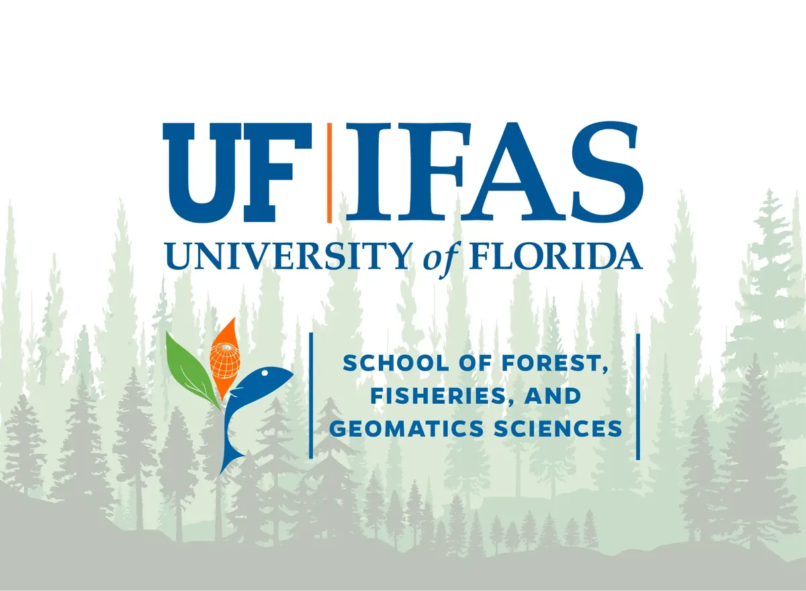

I was awarded a graduate research assistantship through the University of Florida's College of Agricultural & Life Sciences to support my master's research. This two-year position provided funding for my research on wildfire risk in the wildland-urban interface.

{.lightbox fig-alt="Graduate Research Assistantship award"}
