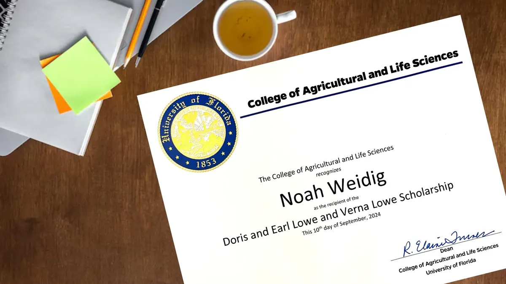

I was awarded the Doris and Earl Lowe and Verna Lowe Scholarship in recognition of academic excellence and commitment to the field of agricultural and life sciences. This scholarship supported my graduate studies at the University of Florida.

{.lightbox fig-alt="Doris and Earl Lowe and Verna Lowe Scholarship award"}
