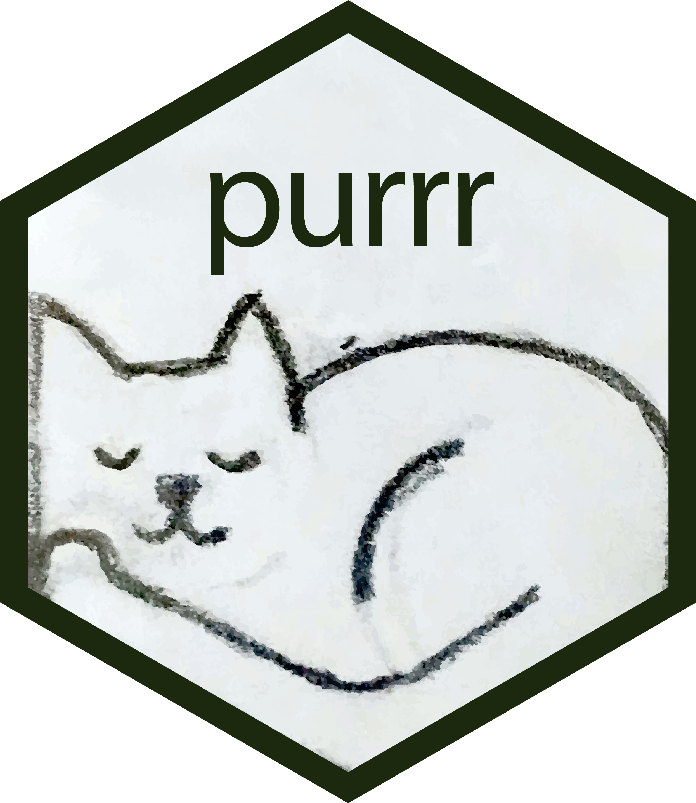
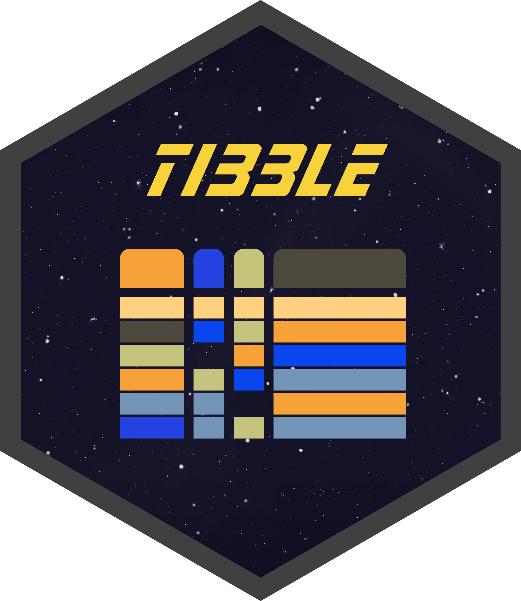
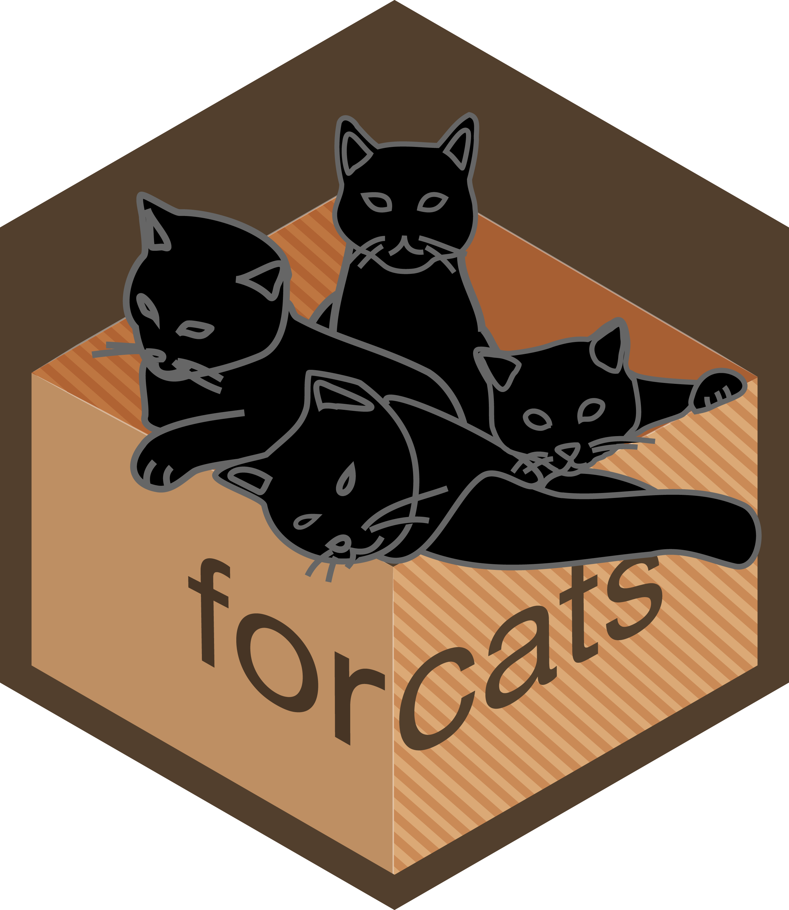
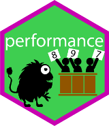
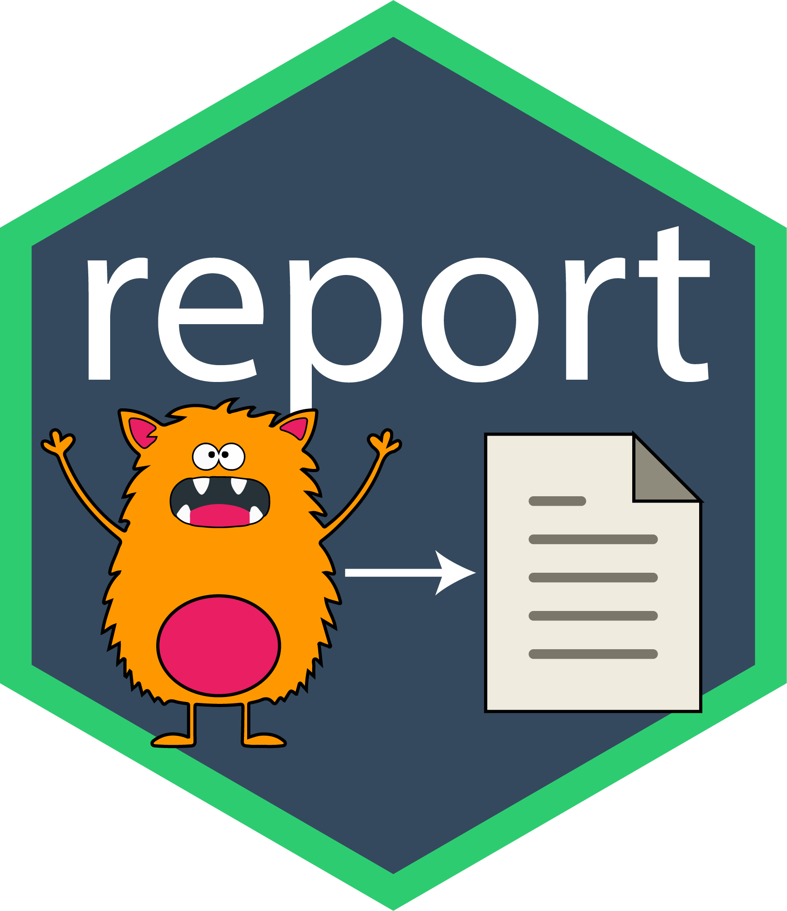

```{r}
#| label: setup
#| include: false

# A single place to control logo sizing and knitr behavior for the whole post.
knitr::opts_chunk$set(
  fig.retina = 2,
  out.width  = "100%"
)

set.seed(42)
```

After enough years writing R, you stop thinking about individual functions and
start thinking about *workflows* — the small, repeated motions of loading data,
reshaping it, modeling it, and communicating a result. The packages below are
the ones that have quietly reshaped those motions for me. None of them are
exotic. That is exactly the point: the best tools are the ones you reach for so
often you forget they are tools at all.

This is not a reference manual. It is a working tour, with runnable code, of the
packages I install on a fresh machine before I do anything else. If you are an
intermediate R user who already knows what a data frame is and has written a
`for` loop or two, this is written for you.

A quick note on style before we start. I use the **native pipe** `|>`
throughout, because it ships with base R (≥ 4.1), has no dependencies, and is
now the default in most modern tidyverse teaching. I switch to the magrittr pipe
`%>%` only in the rare spot where its extra features (like the `.` placeholder
or `%<>%`) genuinely help, and I call it out when I do.

```{r}
#| label: libraries
#| results: hide

library(tidyverse)      # attaches ggplot2, dplyr, tidyr, readr, purrr,
                        # tibble, stringr, forcats, lubridate, and friends
library(palmerpenguins) # the `penguins` dataset used throughout
```

```{r}
#| label: conflicts-note
#| echo: false
#| results: hide

# Loading the tidyverse prints a conflicts banner; we suppress it above with
# message: false, but we discuss those conflicts in the `conflicted` section.
```

## The tidyverse

Before the tidyverse, writing R felt like assembling furniture from three
different manufacturers. Base R's data-frame verbs, the `apply` family, and the
various `read.*` importers each had their own naming conventions, their own
quirks around factors and stringsAsFactors, and their own ideas about what a
"tidy" result looked like. You could get anywhere, but every join in the road
required a different tool and a different mental model.

The tidyverse's contribution was not any single function. It was **consistency**
as a design philosophy. A shared set of principles — data frames in, data frames
out; the first argument is always the data; functions do one thing; missing
values are never silently dropped — meant that once you learned one package, the
next one felt familiar. Add a pipe to chain those functions into a readable
left-to-right sequence, and suddenly R code reads like a description of what you
are actually doing.

```{r}
#| label: tidyverse-teaser

penguins |>
  filter(!is.na(body_mass_g)) |>
  group_by(species, sex) |>
  summarise(
    n           = n(),
    mean_mass_g = mean(body_mass_g),
    .groups     = "drop"
  ) |>
  arrange(desc(mean_mass_g))
```

Read that top to bottom: take the penguins, drop the ones missing a body mass,
group by species and sex, compute a count and a mean, then sort. There is
almost no distance between the sentence and the code. That is the whole idea.

::: {.callout-note}
## What "the tidyverse" actually installs

`library(tidyverse)` is a meta-package. It attaches the eight or nine
packages you use directly and depends on a deeper layer of infrastructure
packages — tidyselect, vctrs, pillar, rlang, cli, glue, and lifecycle — that
you rarely call by name but that power the whole thing. We cover both layers
below.
:::

### ggplot2 

**ggplot2** is the visualization workhorse, and it earns a
[deep dive of its own below](#ggplot2-in-depth). The short version: it
implements the *grammar of graphics*, the idea that any statistical graphic can
be described as data mapped to visual properties (aesthetics) and drawn with
geometric objects (geoms) in layers.

```{r}
#| label: ggplot2-teaser
#| fig-alt: Scatterplot of penguin flipper length versus body mass colored by species.

ggplot(penguins, aes(flipper_length_mm, body_mass_g, colour = species)) +
  geom_point(alpha = 0.8) +
  labs(title = "Flipper length predicts body mass", colour = "Species")
```

We will unpack layering, scales, facets, themes, and annotations in the
[ggplot2 section](#ggplot2-in-depth).

### dplyr 

**dplyr** is the grammar of data manipulation, and it is probably the package I
type most. It boils down data wrangling to a small set of verbs: `filter()`
rows, `select()` columns, `mutate()` new columns, `arrange()` the order,
`summarise()` down to groups, and `group_by()` / `.by` to say *within what*.

The workflow I use constantly is group-summarise-arrange to answer "what's the
typical value, split by category?"

```{r}
#| label: dplyr-verbs

penguins |>
  filter(!is.na(bill_length_mm)) |>
  mutate(bill_ratio = bill_length_mm / bill_depth_mm) |>
  summarise(
    n              = n(),
    mean_ratio     = mean(bill_ratio),
    .by            = species
  ) |>
  arrange(desc(mean_ratio))
```

That `.by` argument is the modern, per-call alternative to `group_by()`; it
groups for a single verb and automatically ungroups afterward, which sidesteps a
whole category of "why is my data frame still grouped?" bugs.

Two more workflows I would not want to live without. First, **joins** for
combining tables:

```{r}
#| label: dplyr-join

island_region <- tibble(
  island = c("Torgersen", "Biscoe", "Dream"),
  region = c("North",     "South",  "East")
)

penguins |>
  distinct(species, island) |>
  left_join(island_region, by = "island") |>
  arrange(species)
```

Second, `across()` for applying the same transformation to many columns without
copy-pasting:

```{r}
#| label: dplyr-across

penguins |>
  summarise(
    across(ends_with("_mm"), \(x) mean(x, na.rm = TRUE)),
    .by = species
  )
```

Notice `ends_with("_mm")` — that is [tidyselect](#under-the-hood) doing the
column selection, a theme we return to.

::: {.callout-tip}
## Favorite dplyr functions

`count()` is `group_by() |> summarise(n = n())` in one call — I use it dozens
of times a day. `slice_max()` / `slice_min()` grab the top-*n* rows per group.
And `case_when()` is the readable replacement for nested `if_else()`.
:::

### tidyr 

Where dplyr manipulates tidy data, **tidyr** *makes* data tidy. Its two headline
functions, `pivot_longer()` and `pivot_wider()`, reshape between wide and long
layouts — the single most common data-cleaning task in the real world.

The classic workflow: measurements sitting in separate columns that really want
to be a single "measurement" variable. ggplot2 in particular loves long data.

```{r}
#| label: tidyr-longer

penguins_long <- penguins |>
  select(species, bill_length_mm, bill_depth_mm, flipper_length_mm) |>
  pivot_longer(
    cols      = ends_with("_mm"),
    names_to  = "measurement",
    values_to = "value"
  )

penguins_long
```

That long form drops straight into a faceted plot:

```{r}
#| label: tidyr-longer-plot
#| fig-alt: Boxplots of three penguin body measurements faceted by measurement type.

penguins_long |>
  filter(!is.na(value)) |>
  ggplot(aes(species, value, fill = species)) +
  geom_boxplot(show.legend = FALSE) +
  facet_wrap(~ measurement, scales = "free_y")
```

Other tidyr tools I lean on: `separate_wider_delim()` for splitting one column
into several, `unnest()` for flattening list-columns (essential when working
with [purrr](#purrr-in-depth) results), and `complete()` for making implicit
missing combinations explicit.

### readr 

**readr** imports rectangular text files — CSVs, TSVs, fixed-width — faster and
more predictably than base R's `read.csv()`. It gets its
[own section below](#readr-in-depth), but the headline is that it returns a
tibble, never converts strings to factors behind your back, and tells you
exactly how it parsed every column.

```{r}
#| label: readr-teaser

# Read a CSV directly from a string — handy for reproducible examples.
read_csv("x,y\n1,a\n2,b\n3,c")
```

### purrr 

**purrr** is functional programming for R: a consistent, type-stable family of
`map()` functions that replace most of the `for` loops and `*apply()` calls you
would otherwise write. It has its [own deep dive](#purrr-in-depth). The one-line
pitch: `map_dbl(x, f)` applies `f` to each element of `x` and *guarantees* it
gives you back a double vector, or errors loudly if it can't.

```{r}
#| label: purrr-teaser

# Fit a model per species and pull out R-squared, all without a loop.
penguins |>
  split(penguins$species) |>
  map_dbl(\(df) summary(lm(body_mass_g ~ flipper_length_mm, df))$r.squared)
```

### tibble 

**tibble** is the tidyverse's modern reimagining of the data frame. Tibbles do
less than base `data.frame`s, and that is a feature: they never change column
types, never do partial name matching, never coerce strings to factors, and
print a clean, columnar summary that shows types and fits your console.

```{r}
#| label: tibble-print

tibble(
  id    = 1:3,
  group = c("a", "b", "a"),
  score = c(9.1, 8.4, 7.7),
  note  = c("first", "second", "third")
)
```

Notice the `<int>`, `<chr>`, `<dbl>` type tags under each name — that display
comes from [pillar](#under-the-hood). Tibbles also support **list-columns**,
where each cell holds an arbitrary object. That is what makes the
"nest, map a model over each group, unnest the results" workflow possible:

```{r}
#| label: tibble-listcol

penguins |>
  nest(.by = species) |>
  mutate(n_rows = map_int(data, nrow))
```

### stringr 

**stringr** wraps the powerful-but-cryptic base string functions in a consistent
`str_` API where the string is always the first argument (so it pipes) and the
pattern is always second. Every function starts with `str_`, which means
autocomplete becomes a menu of everything you can do.

```{r}
#| label: stringr-workflow

tibble(raw = c("  Adelie ", "GENTOO", "chinstrap")) |>
  mutate(
    trimmed = str_trim(raw),
    title   = str_to_title(trimmed),
    n_chars = str_length(trimmed),
    is_a    = str_detect(trimmed, regex("^a", ignore_case = TRUE))
  )
```

My most-used stringr functions are `str_detect()` (filter rows matching a
pattern), `str_replace_all()` (clean up messy text), `str_extract()` (pull a
substring out with a regex), and `str_c()` / [glue](#glue) for gluing strings
together.

### forcats 

**forcats** exists to make categorical variables — factors — bearable. Factor
level order controls the order of bars, legends, and facets in every plot you
make, and base R's tools for reordering them are painful. forcats fixes that
with a `fct_` family.

The workflow that earns its keep: reordering a factor by a summary statistic so
your bar chart is sorted by value instead of alphabetically.

```{r}
#| label: forcats-reorder
#| fig-alt: Bar chart of mean penguin body mass by species, sorted descending.

penguins |>
  filter(!is.na(body_mass_g)) |>
  summarise(mean_mass = mean(body_mass_g), .by = species) |>
  mutate(species = fct_reorder(species, mean_mass)) |>
  ggplot(aes(mean_mass, species)) +
  geom_col(fill = "steelblue") +
  labs(x = "Mean body mass (g)", y = NULL)
```

Other favorites: `fct_infreq()` (order by frequency), `fct_lump_n()` (collapse
rare levels into "Other"), and `fct_recode()` (rename levels explicitly).

### lubridate 

**lubridate** makes dates and times tractable. Parsing, arithmetic, rounding,
time zones — all the things that make base R date handling a chore become
one-liners. It has its [own section below](#lubridate-in-depth), but here is the
flavor:

```{r}
#| label: lubridate-teaser

ymd("2026-07-20") + months(3)
```

### Under the hood {#under-the-hood}

The packages above are the ones you call directly. Underneath them sits a layer
of infrastructure that most users never import explicitly but rely on constantly.
Knowing these exist makes error messages far less mysterious.

- **tidyselect** is the mini-language behind column selection. Every time you
  write `select(ends_with("_mm"))`, `across(where(is.numeric), ...)`, or
  `starts_with("bill")`, that is tidyselect. It turns column selection into its
  own composable grammar with helpers like `matches()`, `all_of()`, `any_of()`,
  and `everything()`.

  ```{r}
  #| label: tidyselect-demo

  penguins |> select(species, where(is.numeric)) |> names()
  ```

- **vctrs** 
  defines the rules for what happens when vectors of different types meet: what
  `c(1L, 2.5)` should become, how a row-bind reconciles column types, what "size"
  and "prototype" mean. It is why tidyverse type coercions are predictable
  instead of surprising.

  ```{r}
  #| label: vctrs-demo

  vctrs::vec_c(factor("a"), factor("b"))  # combines factor levels sensibly
  ```

- **pillar** controls how tibbles print — the column types, the aligned columns,
  the truncation of wide output, the color. Every nicely formatted tibble you
  have ever seen is pillar at work.

- **rlang** 
  is the toolkit for R's metaprogramming: tidy evaluation, the `{{ }}`
  embrace operator, and the condition system. If you have ever written a function
  that takes a column name as a bare argument, you have used rlang.

  ```{r}
  #| label: rlang-demo

  group_mean <- function(df, group, var) {
    df |> summarise(mean = mean({{ var }}, na.rm = TRUE), .by = {{ group }})
  }
  group_mean(penguins, species, body_mass_g)
  ```

- **cli** produces the beautiful, colorful, informative messages and errors you
  see across the tidyverse — the bulleted error hints, the progress bars, the
  symbols. It is why a modern tidyverse error tells you what went wrong *and*
  what to do about it.

- **glue** does string interpolation and gets its [own section](#glue). It shows
  up here because the tidyverse uses it internally to build all those helpful
  messages.

- **lifecycle** is how the tidyverse manages change gracefully. Those
  "deprecated" and "experimental" badges in the docs, and the gentle warnings
  when you use a superseded argument, are lifecycle giving you a runway instead
  of a cliff.

::: {.callout-note}
You will almost never `library()` these directly. But when an error message
mentions "prototype", "size", or "quosure", now you know which package's
worldview you have bumped into.
:::

## ggplot2 in depth {#ggplot2-in-depth}


ggplot2 deserves more than a teaser because it is the package whose mental model
pays the largest dividends. Once the grammar clicks, you stop searching for "the
function that makes *this specific chart*" and start *building* the chart you
want from parts.

### The grammar of graphics and layering

Every ggplot is built from the same components:

1. **Data** — a data frame (usually tidy/long).
2. **Aesthetic mappings** (`aes()`) — which variables map to x, y, colour, size,
   shape, fill.
3. **Geoms** — the geometric objects drawn: points, lines, bars, boxplots.
4. **Scales** — how data values translate to visual values (axis breaks, color
   palettes).
5. **Facets** — small multiples splitting the plot by a variable.
6. **Coordinates** and **theme** — the coordinate system and all non-data ink.

You assemble these with `+`, adding one **layer** at a time. Start simple:

```{r}
#| label: gg-layer-1
#| fig-alt: Basic scatterplot of penguin flipper length versus body mass.

p <- ggplot(penguins, aes(flipper_length_mm, body_mass_g))

p + geom_point()
```

`p` holds the data and the base mapping; every geom we add inherits them. Now
layer a second geom on top — a smooth trend line over the same points:

```{r}
#| label: gg-layer-2
#| fig-alt: Scatterplot of flipper length versus body mass with a linear trend line.

p +
  geom_point(aes(colour = species), alpha = 0.7) +
  geom_smooth(method = "lm", se = TRUE, colour = "black")
```

Two layers, drawn in order, sharing the base `aes()`. The `colour = species`
mapping lives only on `geom_point()`, so the single black regression line is fit
to all points rather than one per species. *Where* you put an aesthetic mapping
determines *what* it affects — that control is the heart of the grammar.

### Scales

Scales govern the translation from data to pixels: axis limits and breaks, and
the palettes behind colour, fill, size, and shape. You rarely need them for a
quick look, but they are how you go from "fine" to "polished."

```{r}
#| label: gg-scales
#| fig-alt: Scatterplot with a viridis color scale and comma-formatted axis.

ggplot(penguins, aes(flipper_length_mm, body_mass_g, colour = bill_length_mm)) +
  geom_point(size = 2, na.rm = TRUE) +
  scale_colour_viridis_c(option = "plasma") +
  scale_y_continuous(labels = scales::label_number(suffix = " g")) +
  labs(colour = "Bill length (mm)")
```

The `scales` package (a ggplot2 dependency) supplies the `label_*` formatters —
`label_comma()`, `label_percent()`, `label_dollar()` — which handle the tedious
job of formatting axis text correctly.

### Faceting

Faceting splits one plot into a grid of small multiples. It is the single most
effective way to show how a relationship varies across a categorical variable,
and it takes one line.

```{r}
#| label: gg-facet
#| fig-alt: Scatterplots of flipper length versus body mass faceted by island and colored by species.

ggplot(penguins, aes(flipper_length_mm, body_mass_g, colour = species)) +
  geom_point(alpha = 0.7, na.rm = TRUE) +
  facet_wrap(~ island) +
  labs(title = "Body size relationships by island")
```

Use `facet_wrap(~ var)` to wrap a single variable into a grid, or
`facet_grid(rows ~ cols)` to cross two variables. The `scales = "free"` argument
lets each panel set its own axis range when the panels live on different scales.

### Annotations

Annotations add reference lines, text, and highlights that are not driven by the
data mapping. They are how you direct the reader's eye to the point you are
making.

```{r}
#| label: gg-annotate
#| fig-alt: Scatterplot with a horizontal reference line at the mean body mass and a text label.

mean_mass <- mean(penguins$body_mass_g, na.rm = TRUE)

ggplot(penguins, aes(flipper_length_mm, body_mass_g)) +
  geom_point(alpha = 0.5, na.rm = TRUE) +
  geom_hline(yintercept = mean_mass, linetype = "dashed", colour = "firebrick") +
  annotate(
    "text", x = 175, y = mean_mass + 150,
    label = paste0("Mean = ", round(mean_mass), " g"),
    colour = "firebrick", hjust = 0
  )
```

### Themes and custom themes

Themes control every non-data element: fonts, gridlines, backgrounds, legend
position, spacing. ggplot2 ships several complete themes (`theme_minimal()`,
`theme_bw()`, `theme_classic()`), and you tweak individual elements with
`theme()`.

```{r}
#| label: gg-theme
#| fig-alt: Scatterplot styled with theme_minimal and a bottom legend.

ggplot(penguins, aes(flipper_length_mm, body_mass_g, colour = species)) +
  geom_point(alpha = 0.8, na.rm = TRUE) +
  theme_minimal(base_size = 13) +
  theme(
    legend.position = "bottom",
    panel.grid.minor = element_blank(),
    plot.title = element_text(face = "bold")
  ) +
  labs(title = "Penguin body size", colour = NULL)
```

If you make a lot of plots, define your house style **once** as a function and
reuse it everywhere. This is the workflow that keeps a report visually
consistent:

```{r}
#| label: gg-custom-theme
#| fig-alt: Scatterplot using a reusable custom theme function.

theme_nw <- function(base_size = 13) {
  theme_minimal(base_size = base_size) +
    theme(
      plot.title       = element_text(face = "bold"),
      plot.title.position = "plot",
      panel.grid.minor = element_blank(),
      legend.position  = "bottom"
    )
}

ggplot(penguins, aes(bill_length_mm, bill_depth_mm, colour = species)) +
  geom_point(alpha = 0.8, na.rm = TRUE) +
  labs(title = "Bill dimensions", colour = NULL) +
  theme_nw()
```

::: {.callout-tip}
Set your custom theme as the session default with
`theme_set(theme_nw())` and every subsequent plot inherits it — no need to add
`+ theme_nw()` to each one.
:::

### Saving plots

Finish with `ggsave()`. It infers the format from the file extension, lets you
set physical dimensions and resolution, and by default saves the last plot you
drew.

```{r}
#| label: gg-save
#| eval: false

p_final <- ggplot(penguins, aes(flipper_length_mm, body_mass_g, colour = species)) +
  geom_point(alpha = 0.8, na.rm = TRUE) +
  theme_nw()

ggsave("penguin-size.png", plot = p_final,
       width = 7, height = 4.5, units = "in", dpi = 300)
```

Save vector formats (`.pdf`, `.svg`) for print and line art; save `.png` at
300 dpi for the web and slides. Set the dimensions in the *save* call, not by
resizing afterward, so text and points scale correctly.

## readr in depth {#readr-in-depth}


Base R's `read.csv()` works, but it has habits that cost you time: it guesses
column types opaquely, historically converted strings to factors, mangles column
names, and gives you no summary of what it did. **readr** replaces it with
importers that are faster, return tibbles, and are transparent about parsing.

For most projects readr is the right default. (For genuinely large files, reach
for [vroom](#vroom), which shares readr's interface.)

### read_csv, read_tsv, and friends

```{r}
#| label: readr-basic

csv_text <- "id,species,mass_g,measured
1,Adelie,3750,2026-01-05
2,Gentoo,5400,2026-01-06
3,Chinstrap,3700,2026-01-07"

read_csv(csv_text)
```

Notice the message readr prints (suppressed here, but present interactively): a
column specification telling you it read `id` and `mass_g` as doubles,
`species` as character, and `measured` as a date. `read_tsv()` is the same for
tab-separated files, and `read_delim()` handles any delimiter.

### Column specification

The best habit in readr is to *state* your expected column types with `col_types`
rather than letting the parser guess. This makes imports reproducible and turns
silent type surprises into explicit errors.

```{r}
#| label: readr-coltypes

read_csv(
  csv_text,
  col_types = cols(
    id       = col_integer(),
    species  = col_factor(levels = c("Adelie", "Gentoo", "Chinstrap")),
    mass_g   = col_double(),
    measured = col_date(format = "%Y-%m-%d")
  )
)
```

The compact string form is handy for quick work: `col_types = "ifdD"` means
integer, factor, double, Date — one letter per column.

### Parsing dates, numbers, and missing values

readr's `parse_*()` functions are the same machinery you can call directly, which
is great for cleaning messy columns after import.

```{r}
#| label: readr-parse

parse_date(c("2026-07-20", "2026-01-01"))

# Numbers with currency symbols, thousands separators, and percent signs:
parse_number(c("$1,299.00", "45%", "1.2M grams"))

# Declaring what counts as missing:
parse_double(c("3750", "N/A", "-999"), na = c("N/A", "-999"))
```

That last example is the workflow for messy real-world data: tell readr which
sentinel values (`"N/A"`, `"-999"`, `""`) mean "missing" via the `na` argument
to `read_csv()`, and they come in as proper `NA` instead of poisoning a numeric
column into character.

::: {.callout-tip}
When readr guesses a column wrong, it prints the exact `col_types`
specification it used. Copy that into your call, edit the one column that was
wrong, and your import is now explicit and reproducible.
:::

## purrr in depth {#purrr-in-depth}


If you find yourself writing a `for` loop to build up a result vector or list,
purrr almost certainly has a cleaner, safer way. The core idea is **iteration as
a function call**: `map(x, f)` applies `f` to every element of `x` and returns a
list; the typed variants return exactly the vector type they promise.

### map and its typed variants

```{r}
#| label: purrr-map-family

nums <- list(a = 1:5, b = 6:10, c = 11:15)

map(nums, mean)        # always returns a list
map_dbl(nums, mean)    # returns a double vector
map_chr(nums, \(x) paste0("sum=", sum(x)))  # returns a character vector
```

The typed variants (`map_dbl`, `map_int`, `map_chr`, `map_lgl`) are the reason
to prefer purrr over `sapply()`: they *guarantee* the output type. If a function
ever returns the wrong type, purrr errors immediately instead of silently
handing you a list or a matrix like `sapply()` might.

The `\(x) ...` syntax is R's **anonymous function** shorthand (R ≥ 4.1),
equivalent to `function(x) ...`. purrr also accepts the `~ .x` formula style
(`~ paste0("sum=", sum(.x))`), but I prefer the base anonymous function now that
it exists — it works everywhere, not just inside purrr.

### Building data frames: map + list_rbind

A workflow I use constantly: run something over many inputs and stack the results
into one tibble. The modern idiom is `map()` to a list of tibbles, then
`list_rbind()`:

```{r}
#| label: purrr-list-rbind

fit_species <- function(sp) {
  df <- filter(penguins, species == sp)
  m  <- lm(body_mass_g ~ flipper_length_mm, df)
  tibble(species = sp, slope = coef(m)[["flipper_length_mm"]], r2 = summary(m)$r.squared)
}

unique(penguins$species) |>
  map(fit_species) |>
  list_rbind()
```

`list_rbind()` (and its column-wise sibling `list_cbind()`) superseded the older
`map_dfr()` / `map_df()`. If you learned `map_dfr()`, it still works, but
`map(...) |> list_rbind()` is the current recommendation.

### safely and possibly: iteration that survives failure

The real power of purrr shows up when some iterations fail. A loop dies on the
first error; `safely()` and `possibly()` let the rest continue.

`possibly()` returns a fallback value on error:

```{r}
#| label: purrr-possibly

safe_log <- possibly(log, otherwise = NA_real_)
map_dbl(list(1, 10, "oops", 100), safe_log)
```

`safely()` returns a list with `result` and `error` slots for *every* call, so
you can inspect exactly what went wrong where:

```{r}
#| label: purrr-safely

safe_log2 <- safely(log)
results   <- map(list(1, "bad", 100), safe_log2)

# Split successes from failures:
str(results[[2]])
```

::: {.callout-note}
`map2()` iterates over two inputs in parallel, and `pmap()` over any number of
inputs supplied as a list or data-frame columns. Between `map`, `map2`, and
`pmap`, plus the typed suffixes, you can express nearly any iteration without a
single explicit loop.
:::

## lubridate in depth {#lubridate-in-depth}


Dates are where base R frustrates people most: the format strings, the time-zone
surprises, the awkward arithmetic. **lubridate** replaces all of it with
functions that do what their names say.

### Parsing: name the function after the order of the parts

You do not write format strings in lubridate. You pick the function whose name
matches the order the date parts appear — `ymd`, `mdy`, `dmy` — and it figures
out the separators.

```{r}
#| label: lubridate-parse

ymd("2026-07-20")
mdy("July 20, 2026")
dmy("20/07/2026")
ymd_hms("2026-07-20 14:30:05")
```

All three of those first calls produce the identical Date. That robustness to
input format is the whole appeal.

### Rounding: floor_date and ceiling_date

Bucketing timestamps into days, weeks, or months is the backbone of every
time-series summary. `floor_date()` rounds down to the start of a unit,
`ceiling_date()` rounds up.

```{r}
#| label: lubridate-rounding

ts <- ymd_hms("2026-07-20 14:37:12")

floor_date(ts, unit = "hour")
floor_date(ts, unit = "month")
ceiling_date(ts, unit = "week")
```

The real-world workflow — turn raw timestamps into a monthly count:

```{r}
#| label: lubridate-bucket

tibble(event_time = ymd("2026-01-01") + days(sample(0:180, 500, replace = TRUE))) |>
  mutate(month = floor_date(event_time, "month")) |>
  count(month) |>
  head(4)
```

### Intervals, durations, and periods

lubridate distinguishes three flavors of "time span," and knowing the difference
prevents subtle bugs:

- **Durations** (`ddays()`, `dweeks()`) are exact clock time — a `ddays(1)` is
  always 86,400 seconds, even across a daylight-saving boundary.
- **Periods** (`days()`, `months()`) track human calendar units — `months(1)`
  lands on the same day-of-month next month, however many days that is.
- **Intervals** (`a %--% b`) are a specific span between two fixed instants, which
  you can measure or check membership against.

```{r}
#| label: lubridate-spans

start <- ymd("2026-01-31")

start + months(1)   # period: lands on Feb 28 (calendar-aware)
start + ddays(30)   # duration: exactly 30 * 86400 seconds later

trip <- ymd("2026-07-01") %--% ymd("2026-07-15")   # an interval
as.numeric(trip, "days")
ymd("2026-07-10") %within% trip
```

### Time zones

Time zones are lubridate's other quiet superpower. `with_tz()` shows the *same
instant* in a different zone; `force_tz()` *reinterprets* the clock reading as if
it were in another zone (usually to fix data that was labeled wrong).

```{r}
#| label: lubridate-tz

meeting <- ymd_hms("2026-07-20 09:00:00", tz = "America/New_York")

with_tz(meeting, "Europe/London")   # same moment, London clock
force_tz(meeting, "Europe/London")  # relabel the clock reading itself
```

::: {.callout-warning}
`with_tz()` versus `force_tz()` is the classic time-zone bug. If your
timestamps are off by exactly your UTC offset, you almost certainly used one
where you needed the other.
:::

## Utility packages

The tidyverse gets the headlines, but a project's *reproducibility* rests on a
quieter set of tools. These are the packages that make a script run the same way
on your laptop, your collaborator's machine, and a server two years from now.

### fs 

**fs** provides a consistent, cross-platform API for file-system work. Base R's
`file.*` and `dir.*` functions have inconsistent names, mixed return types, and
platform quirks; fs functions all start with `file_`, `dir_`, or `path_`, return
tidy character vectors of paths, and behave identically on Windows, macOS, and
Linux.

```{r}
#| label: fs-paths

library(fs)

# Build paths without worrying about separators:
p <- path("data", "raw", "penguins.csv")
p
path_ext(p)
path_file(p)
```

The everyday workflow is listing, filtering, and acting on files. fs makes
recursive listing and filtering by glob trivial:

```{r}
#| label: fs-dir-ops

# Create a small tree in a temp directory to demonstrate safely.
tmp <- path(tempdir(), "fs-demo")
dir_create(path(tmp, c("raw", "clean")))
file_create(path(tmp, "raw", c("a.csv", "b.csv", "notes.txt")))

# Recursive listing, filtered to CSVs:
dir_ls(tmp, recurse = TRUE, glob = "*.csv")
```

Copy, move, and delete are `file_copy()`, `file_move()`, and `file_delete()`
(with `dir_delete()` for whole trees). The `dir_info()` function returns a tibble
of file metadata — size, modification time, permissions — which pipes straight
into dplyr for "find me every file over 100 MB older than a year" queries.

```{r}
#| label: fs-cleanup
#| include: false
dir_delete(tmp)  # tidy up the demo directory
```

### here

**here** solves one specific, maddening problem: file paths that break the moment
you run a script from a different working directory, or send it to a collaborator,
or knit a document from a subfolder.

The anti-pattern is `setwd("/Users/noah/projects/penguins/data")` hard-coded at
the top of a script. It works exactly once, on exactly one machine. The moment
anyone else runs it — or you reorganize your folders — it breaks.

`here::here()` builds paths relative to your **project root** (the folder with
your `.Rproj`, `.git`, or a `.here` file), no matter where the current working
directory happens to be:

```{r}
#| label: here-demo
#| eval: false

library(here)

# Always resolves to <project-root>/data/raw/penguins.csv,
# whether you run this from the console, a subfolder, or a Quarto render:
read_csv(here("data", "raw", "penguins.csv"))
```

```{r}
#| label: here-root
#| eval: false

here()          # prints the detected project root
```

::: {.callout-tip}
## Why here beats setwd()

`setwd()` encodes an absolute path that is true only on your machine at one
moment. `here()` encodes a path *relative to the project*, which is true on any
machine, for anyone, forever. The rule of thumb: never write `setwd()` in a
script you intend to share or re-run.
:::

### glue  {#glue}

**glue** is string interpolation done right. Instead of juggling `paste0()` with
a dozen commas, you write the string once and drop `{expressions}` inline — they
are evaluated and spliced in. It reads exactly like the sentence you are building.

```{r}
#| label: glue-basic

library(glue)

species <- "Gentoo"
n       <- 124
glue("We measured {n} {species} penguins.")
```

glue is **vectorized**, which makes it perfect for generating filenames, labels,
and SQL in bulk:

```{r}
#| label: glue-vectorized

ids <- 1:3
glue("penguin_{sprintf('%03d', ids)}.csv")
```

A few workflows where glue shines:

```{r}
#| label: glue-uses

# Dynamic plot titles and labels:
sp <- "Adelie"; yr <- 2026
title <- glue("{sp} body mass, {yr}")

# Safe-ish SQL construction with glue_sql (quotes identifiers and values):
tbl <- "penguins"; min_mass <- 4000
glue("SELECT * FROM {tbl} WHERE body_mass_g > {min_mass}")

# Multi-line report snippets that read like prose:
glue("
  Summary
  -------
  Species:  {sp}
  Records:  {n}
  Avg mass: {round(mean(penguins$body_mass_g, na.rm = TRUE))} g
")
```

For real database work, `glue::glue_sql()` (with a live connection) properly
quotes identifiers and escapes values to guard against injection — always prefer
it over hand-built query strings.

### conflicted

When two attached packages export a function with the same name, R silently uses
whichever package was loaded *last*. That is how you end up calling
`stats::filter()` when you meant `dplyr::filter()` and get a baffling error. The
tidyverse prints a conflicts banner on load precisely because this is a real
hazard.

**conflicted** replaces that silent, order-dependent behavior with a loud, safe
one: any ambiguous call becomes an **error** that forces you to choose.

```{r}
#| label: conflicted-demo
#| eval: false

library(conflicted)
library(dplyr)
library(MASS)     # also exports select()

# This now ERRORS instead of silently picking one:
# select(penguins, species)

# Declare your preference once, at the top of the script:
conflict_prefer("select", winner = "dplyr")
conflict_prefer("filter", winner = "dplyr")

# ...and every later call resolves unambiguously.
select(penguins, species)
```

::: {.callout-note}
conflicted makes scripts *self-documenting*: the `conflict_prefer()` calls at
the top state exactly which function every ambiguous name refers to, so a reader
(or future you) never has to guess.
:::

### vroom  {#vroom}

**vroom** reads delimited files *fast* — often several times faster than readr on
large data. Its trick is **lazy, altrep-backed reading**: it indexes the file up
front but only materializes each column into memory when you actually touch it.
If you read a 50-column file and use 5 columns, you pay for 5.

Conceptually, vroom is readr's speed-focused sibling with a nearly identical
interface — `vroom()` maps onto `read_csv()`. Use readr as your everyday default
for clarity and helpful messages; reach for vroom when file size becomes the
bottleneck.

```{r}
#| label: vroom-benchmark

library(vroom)

# Write a moderately sized CSV to a temp file, then compare read times.
big <- tibble(
  id    = 1:2e5,
  group = sample(letters[1:8], 2e5, replace = TRUE),
  x     = rnorm(2e5),
  y     = runif(2e5)
)
csv_path <- tempfile(fileext = ".csv")
vroom_write(big, csv_path, delim = ",")

timing <- bench::mark(
  readr = readr::read_csv(csv_path, show_col_types = FALSE),
  vroom = vroom::vroom(csv_path, show_col_types = FALSE),
  check = FALSE,
  iterations = 3
)
timing[, c("expression", "min", "median", "mem_alloc")]
```

```{r}
#| label: vroom-cleanup
#| include: false
file.remove(csv_path)
```

::: {.callout-tip}
The speed gap widens with file size and column count, and is largest when you
read many columns but *use* only a few. For a 200 MB export you filter down to a
handful of columns, vroom's laziness can be the difference between seconds and a
coffee break.
:::

### renv 

Reproducibility is not just about code — it is about the *exact package versions*
that code ran against. **renv** gives every project its own private, isolated
library and records the precise versions in a lockfile, so a project that worked
today still works when you return to it after ggplot2 has had three releases.

The mental model: `renv` is to R packages what a virtual environment is to Python
or a lockfile is to npm. The core workflow is four verbs.

```{r}
#| label: renv-workflow
#| eval: false

library(renv)

# 1. init(): create a project-local library and take a first snapshot.
renv::init()

# 2. Work normally — install and use packages as you always would.
install.packages("ggplot2")

# 3. snapshot(): record the exact state into renv.lock.
renv::snapshot()

# 4. restore(): on another machine (or later), rebuild the library
#    to match the lockfile exactly.
renv::restore()
```

The **lockfile** (`renv.lock`) is a JSON record of every package, its version,
and its source (CRAN, Bioconductor, GitHub). You commit it to git alongside your
code. A collaborator clones the repo, runs `renv::restore()`, and gets a byte-
for-byte match of your package environment — no "works on my machine" ever again.

A realistic project workflow looks like this:

1. Start a project, run `renv::init()` once.
2. As you develop, install packages freely; run `renv::snapshot()` whenever you
   add or upgrade one, and commit the updated `renv.lock`.
3. Your collaborator (or CI server, or future self) runs `renv::restore()` after
   pulling, and the environment is reconstructed exactly.

::: {.callout-warning}
renv isolates **package versions**, not the R version itself or system
libraries. For fully airtight reproducibility on a specific date, pair renv with
a pinned R version and, for the truly demanding, a Docker image or the RSPM/PPM
date-based snapshots.
:::

## The easystats ecosystem

The tidyverse made *data wrangling* consistent. **easystats** does the same for
*statistical modeling and reporting*. It is a collection of packages that work
with the model objects R already produces — `lm`, `glm`, `lmer`, brms, and
dozens more — and give you a uniform way to extract, assess, describe, and report
them. The unifying promise: the same function call works across model types, so
you stop memorizing one accessor for `lm` and another for `glmer`.

Let's fit a model to use throughout this section.

```{r}
#| label: easystats-model

model <- lm(body_mass_g ~ flipper_length_mm + species + sex, data = penguins)
```

### insight 

**insight** is the foundation the rest of easystats is built on. It knows how to
reach *inside* virtually any model object and pull out its parts — the formula,
the data, the predictors, the response, the parameters — through one consistent
API. You rarely call it directly, but it is why `parameters` and `performance`
work identically across model types.

```{r}
#| label: insight-demo

library(insight)

get_predictors(model) |> head(3)
find_formula(model)
```

### parameters 

**parameters** extracts and formats a model's coefficients — estimates, standard
errors, confidence intervals, and *p*-values — into a clean, consistent table. It
is the tidy `summary()` you always wanted, and it works the same whether the
model is an `lm` or a mixed model.

```{r}
#| label: parameters-demo

library(parameters)

model_parameters(model)
```

### performance 

**performance** assesses model quality: R², RMSE, AIC/BIC, ICC, and a full suite
of assumption checks (normality, heteroscedasticity, collinearity, influential
points). The `check_model()` function produces a single diagnostic dashboard that
replaces a dozen manual `plot()` calls.

```{r}
#| label: performance-metrics

library(performance)

model_performance(model)
check_collinearity(model)
```

```{r}
#| label: performance-checkmodel
#| fig-height: 8
#| fig-alt: A grid of regression diagnostic plots produced by performance::check_model.

check_model(model)
```

### effectsize 

**effectsize** computes and interprets standardized effect sizes — Cohen's *d*,
eta-squared, standardized coefficients — and, crucially, translates them into
plain-language interpretations ("small", "medium", "large") using documented
rules of thumb.

```{r}
#| label: effectsize-demo

library(effectsize)

# Standardized parameters put coefficients on a comparable scale:
standardize_parameters(model) |> head(4)

# Eta-squared for each term in an ANOVA-style decomposition:
aov(body_mass_g ~ flipper_length_mm + species + sex, data = penguins) |>
  eta_squared()
```

### correlation 

**correlation** turns correlation analysis into a single tidy call. It handles
Pearson, Spearman, partial, and Bayesian correlations, returns a tibble with
confidence intervals and *p*-values, and can produce a full correlation matrix
ready for plotting.

```{r}
#| label: correlation-demo

library(correlation)

penguins |>
  select(ends_with("_mm"), body_mass_g) |>
  correlation()
```

### datawizard 

**datawizard** is easystats' data-preparation toolkit — the tidyverse-adjacent
layer for the statistical side. It handles reshaping, standardizing, centering,
rescaling, and recoding, with a consistent API that plays well with modeling
functions. Think of it as dplyr/tidyr's cousin, tuned for the transformations
statisticians reach for.

```{r}
#| label: datawizard-demo

library(datawizard)

penguins |>
  select(species, bill_length_mm, body_mass_g) |>
  standardize() |>
  head(4)

# Compact, statistics-oriented summaries:
penguins |>
  select(bill_length_mm, body_mass_g) |>
  describe_distribution()
```

### modelbased 

**modelbased** computes and visualizes model-based predictions, estimated
marginal means, and contrasts. Instead of reading coefficients and doing mental
arithmetic, you ask the model directly: "what does it predict for each species?"

```{r}
#| label: modelbased-demo

library(modelbased)

estimate_means(model, by = "species")
```

### bayestestR 

**bayestestR** provides the vocabulary of Bayesian inference: credible intervals
(HDIs), probability of direction (pd), ROPE-based tests, and Bayes factors. Even
if you work mostly with frequentist models, its `describe_posterior()` and
distribution utilities are useful. Here it is on a simulated posterior:

```{r}
#| label: bayestestr-demo

library(bayestestR)

posterior <- distribution_normal(4000, mean = 200, sd = 40)
describe_posterior(posterior, test = c("p_direction", "rope"))
```

### see 

**see** is the visualization layer for easystats. It provides ggplot2 geoms,
scales, and themes, and — most usefully — `plot()` methods for the objects the
other easystats packages return. That `check_model()` dashboard above? see draws
it. It is the reason easystats output looks polished with no extra effort.

```{r}
#| label: see-demo
#| fig-alt: A see-styled plot of the model's estimated marginal means by species.

library(see)

estimate_means(model, by = "species") |>
  plot() +
  theme_lucid()
```

### report 

**report** is the package that still delights me. It takes a model (or a data
frame, or a *t*-test) and writes a **paragraph of publication-ready prose**
describing it — effect sizes, significance, interpretation, and all — following
reporting standards. It is a first draft of your results section, generated from
the model itself.

```{r}
#| label: report-demo
#| results: asis

library(report)

report(model)
```

::: {.callout-tip}
`report()` also works on data frames (`report(penguins)` for a descriptive
summary), on `t.test()` and `cor.test()` objects, and on your loaded packages
(`report(sessionInfo())` for a citations paragraph). It is a genuine time-saver
for the methods section.
:::

## Visualization extensions

ggplot2 is extensible by design, and a whole ecosystem has grown around it. These
three packages solve problems the core package deliberately leaves open:
visualizing uncertainty, composing multiple plots, and finishing figures for
publication.

### ggdist 

**ggdist** is for visualizing *distributions and uncertainty* — the thing bar
charts with error bars do badly. It adds a family of "slabinterval" geoms that
draw a distribution's shape (the slab) together with a point-and-interval summary
(the interval), so a reader sees the full uncertainty, not just a mean ± SE.

The signature geom is `stat_halfeye()`, which draws a density "half-eye": half a
violin plus a median and credible interval.

```{r}
#| label: ggdist-halfeye
#| fig-alt: Half-eye distribution plots of penguin body mass by species.

library(ggdist)

penguins |>
  filter(!is.na(body_mass_g)) |>
  ggplot(aes(x = body_mass_g, y = species, fill = species)) +
  stat_halfeye(show.legend = FALSE) +
  labs(title = "Body mass distributions with uncertainty", y = NULL) +
  theme_nw()
```

The whole `slabinterval` family shares a grammar — `stat_dots()` for dot plots,
`stat_gradientinterval()` for gradient-shaded intervals, `stat_interval()` for
layered intervals. Because ggdist understands distribution objects, you can also
plot *analytical* distributions directly, which is invaluable for showing a model's
predicted uncertainty rather than just raw data:

```{r}
#| label: ggdist-dist
#| fig-height: 3
#| fig-alt: A half-eye plot of an analytical normal distribution.

tibble(mean = 4200, sd = 800) |>
  ggplot(aes(y = "prediction", xdist = distributional::dist_normal(mean, sd))) +
  stat_halfeye() +
  labs(x = "Predicted body mass (g)", y = NULL) +
  theme_nw()
```

### patchwork 

**patchwork** composes separate ggplots into a single figure using arithmetic
operators. No more `grid.arrange()` incantations — you literally add plots
together. It is the most intuitive plot-composition tool in R.

```{r}
#| label: patchwork-setup

p1 <- ggplot(penguins, aes(flipper_length_mm, body_mass_g, colour = species)) +
  geom_point(alpha = 0.7, na.rm = TRUE, show.legend = FALSE) +
  theme_nw()

p2 <- ggplot(penguins, aes(species, bill_length_mm, fill = species)) +
  geom_boxplot(na.rm = TRUE, show.legend = FALSE) +
  theme_nw()

p3 <- ggplot(penguins, aes(body_mass_g, fill = species)) +
  geom_density(alpha = 0.6, na.rm = TRUE) +
  theme_nw()
```

The operators say what they do: `+` packs plots into a grid, `|` places them
side by side, `/` stacks them vertically. Parentheses nest layouts.

```{r}
#| label: patchwork-layout
#| fig-height: 6
#| fig-alt: Three penguin plots composed with patchwork, one on top spanning two below.

library(patchwork)

(p1 | p2) / p3
```

patchwork also collects shared legends and adds figure-level annotations —
titles, tags, captions — across the whole composition:

```{r}
#| label: patchwork-annotate
#| fig-height: 4
#| fig-alt: Two penguin plots side by side with a shared legend and panel tags A and B.

pa <- ggplot(penguins, aes(flipper_length_mm, body_mass_g, colour = species)) +
  geom_point(alpha = 0.7, na.rm = TRUE) + theme_nw()
pb <- ggplot(penguins, aes(bill_length_mm, bill_depth_mm, colour = species)) +
  geom_point(alpha = 0.7, na.rm = TRUE) + theme_nw()

(pa + pb) +
  plot_layout(guides = "collect") +
  plot_annotation(
    title = "Penguin morphology",
    tag_levels = "A"
  ) &
  theme(legend.position = "bottom")
```

That trailing `&` applies a theme change to *every* subplot at once — a
patchwork feature for enforcing consistency across a composition.

### cowplot 

**cowplot** predates some of patchwork's features and remains the go-to for
**publication-quality** figure assembly, especially when you need precise
*alignment* of plot axes across panels and tightly controlled shared legends. Its
`plot_grid()` aligns panels by their plotting areas, so axes line up even when
labels differ in width.

```{r}
#| label: cowplot-grid
#| fig-height: 4
#| fig-alt: Two penguin plots arranged in a labeled grid with aligned axes via cowplot.

library(cowplot)

cp1 <- ggplot(penguins, aes(flipper_length_mm, body_mass_g)) +
  geom_point(alpha = 0.6, na.rm = TRUE) + theme_cowplot()
cp2 <- ggplot(penguins, aes(species, body_mass_g)) +
  geom_boxplot(na.rm = TRUE) + theme_cowplot()

plot_grid(cp1, cp2, labels = c("A", "B"), align = "h", ncol = 2)
```

The shared-legend workflow is a cowplot classic: extract one plot's legend, then
place it once for the whole grid.

```{r}
#| label: cowplot-legend
#| fig-height: 4
#| fig-alt: Two penguin plots sharing a single legend placed at the bottom via cowplot.

leg_plot <- ggplot(penguins, aes(flipper_length_mm, body_mass_g, colour = species)) +
  geom_point(na.rm = TRUE) +
  theme_cowplot() +
  theme(legend.position = "bottom")

legend  <- get_plot_component(leg_plot, "guide-box", return_all = TRUE)[[1]]
panels  <- plot_grid(
  cp1 + theme(legend.position = "none"),
  cp2 + theme(legend.position = "none"),
  labels = c("A", "B"), align = "h"
)

plot_grid(panels, legend, ncol = 1, rel_heights = c(1, 0.1))
```

::: {.callout-note}
## patchwork or cowplot?

They overlap. I default to **patchwork** for its readable operator syntax and
built-in legend collection, and switch to **cowplot** when I need pixel-precise
axis alignment, its `theme_cowplot()` look, or its drawing tools (`ggdraw()`,
`draw_image()`) for annotating figures with external logos or insets.
:::

## Conclusion

None of these packages is magic on its own. What makes them my favorites is how
they *compose* — how readr hands a tibble to dplyr, which hands it to ggplot2,
while [here](#here) keeps the paths honest, [renv](#renv) keeps the versions
pinned, and [report](#report) writes the first draft of the conclusion. Each one
removes a small, recurring source of friction, and together they turn analysis
from a fight with the tools into a conversation with the data.

If you are just starting to build your own toolkit, I would begin with the
tidyverse core, add [here](#here) and [renv](#renv) on day one for
reproducibility, and pull in the specialized packages — easystats, ggdist,
patchwork — as your projects demand them. You do not need all of these at once.
You need the next one that removes the friction you are feeling right now.

Happy analyzing. And if you build something you are proud of with these, I would
love to hear about it.

```{r}
#| label: session-info

sessionInfo()
```
