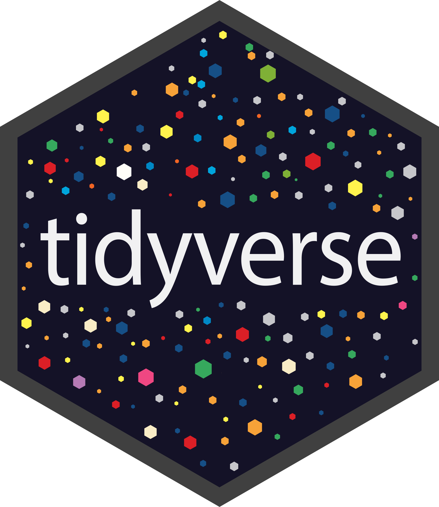
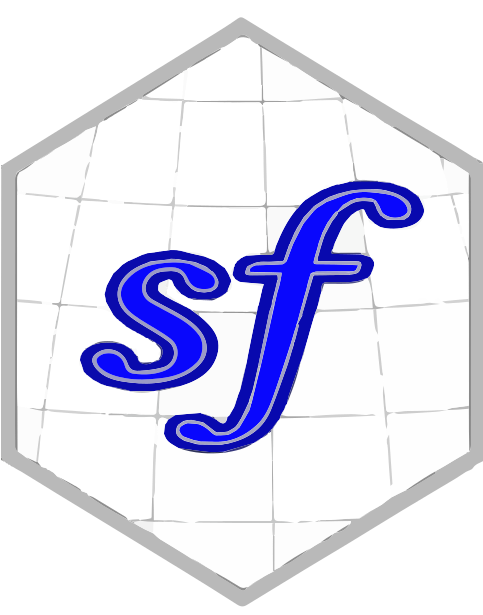
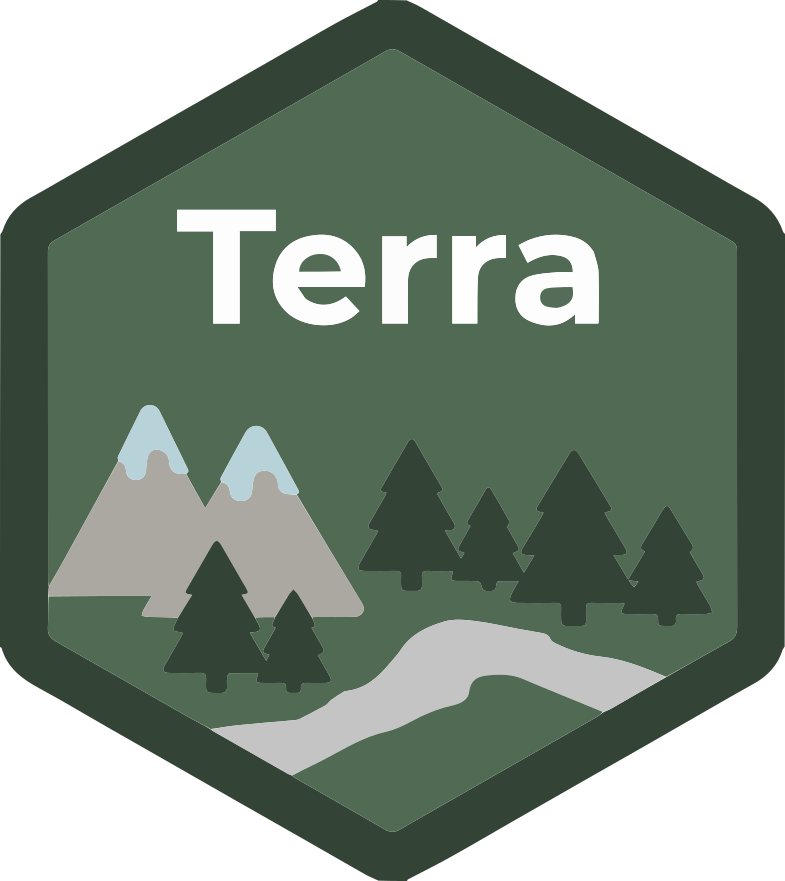
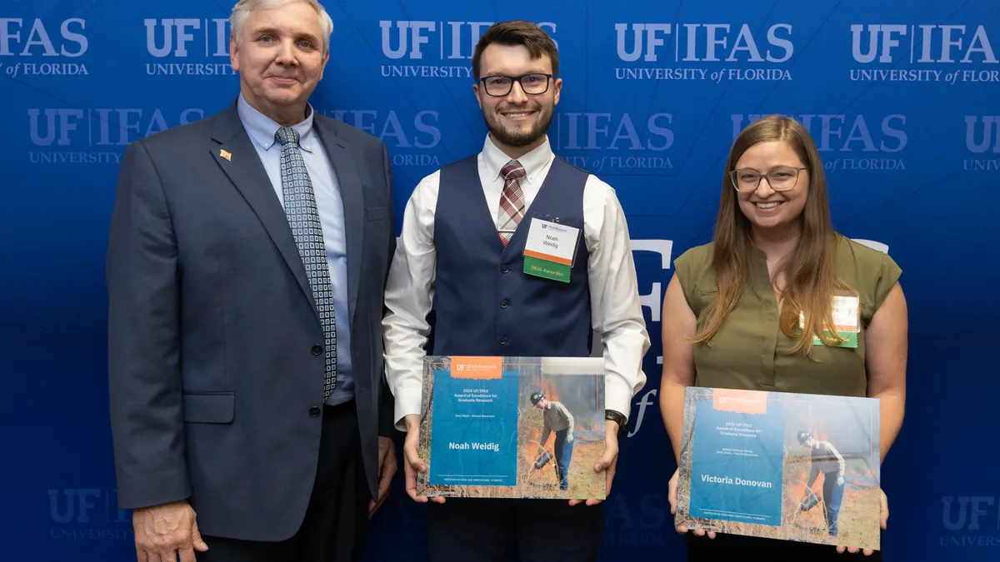
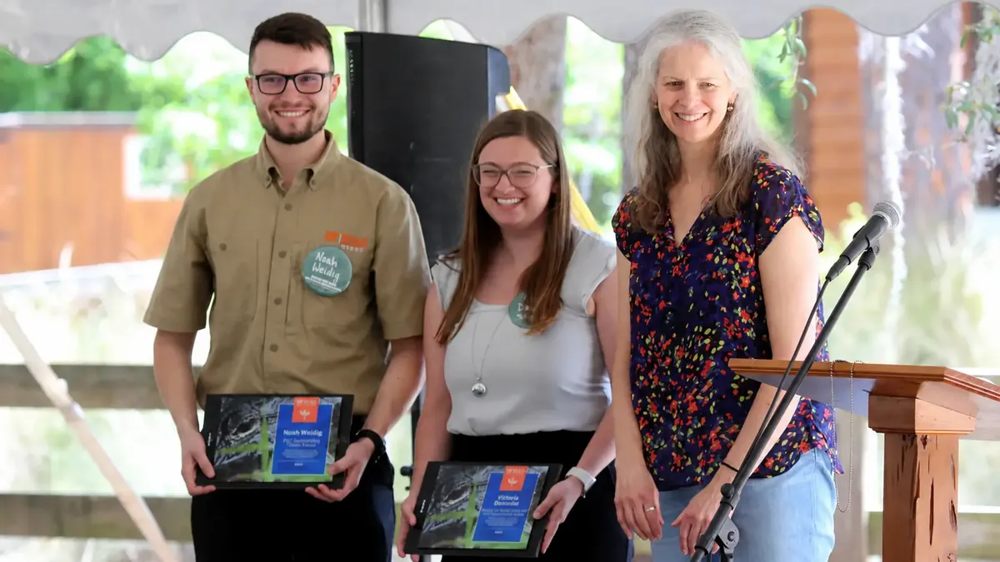
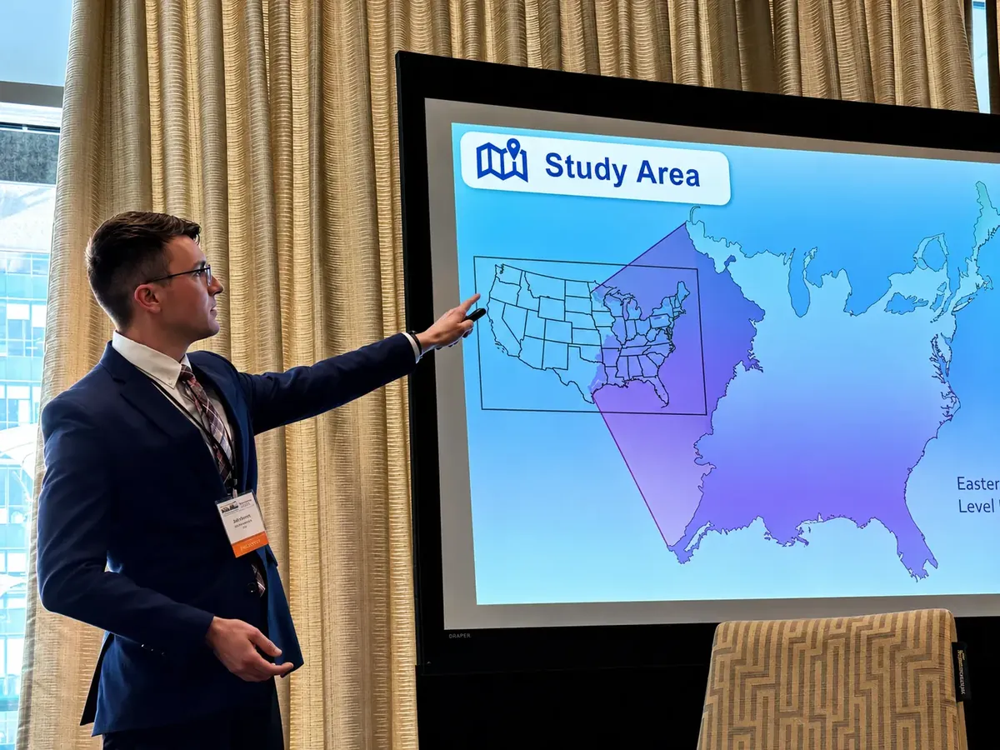
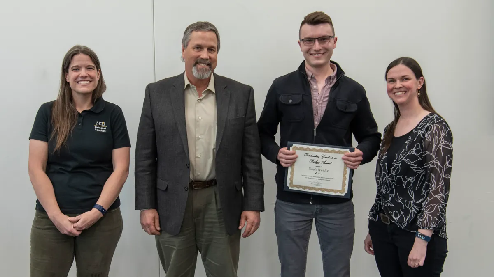

```{=html}
<section id="hero">
  
  <div><span class="nw-status">Open to opportunities</span></div>
  <h1>Hi, I'm <span class="nw-name">Noah Weidig</span></h1>
  <div class="nw-role">GIS Analyst • Data Scientist</div>
  <div class="nw-type">I build <span class="nw-typed" data-strings='["geospatial analyses","remote sensing workflows","data-driven insights","GIS applications"]'></span><span class="nw-caret">&nbsp;</span></div>
  <div class="nw-socials">
    <a href="https://www.linkedin.com/in/noahweidig/" aria-label="LinkedIn" target="_blank" rel="noopener"><svg viewBox="0 0 24 24" fill="none" stroke="currentColor" stroke-width="1.5" stroke-linecap="round" stroke-linejoin="round"><rect x="4" y="4" width="16" height="16" rx="2"/><path d="M8 11v5"/><path d="M8 8v.01"/><path d="M12 16v-5"/><path d="M16 16v-3a2 2 0 0 0 -4 0"/></svg></a>
    <a href="https://github.com/noahweidig/" aria-label="GitHub" target="_blank" rel="noopener"><svg viewBox="0 0 24 24" fill="none" stroke="currentColor" stroke-width="1.5" stroke-linecap="round" stroke-linejoin="round"><path d="M9 19c-4.3 1.4 -4.3 -2.5 -6 -3m12 5v-3.5c0 -1 .1 -1.4 -.5 -2c2.8 -.3 5.5 -1.4 5.5 -6.1a4.6 4.6 0 0 0 -1.3 -3.2a4.2 4.2 0 0 0 -.1 -3.2s-1.1 -.3 -3.5 1.3a12.3 12.3 0 0 0 -6.2 0c-2.4 -1.6 -3.5 -1.3 -3.5 -1.3a4.2 4.2 0 0 0 -.1 3.2a4.6 4.6 0 0 0 -1.3 3.2c0 4.6 2.7 5.7 5.5 6.1c-.6 .6 -.6 1.2 -.5 2v3.5"/></svg></a>
    <a href="https://scholar.google.com/citations?hl=en&user=Ml95eTwAAAAJ" aria-label="Google Scholar" target="_blank" rel="noopener"><svg viewBox="0 0 24 24" fill="none" stroke="currentColor" stroke-width="1.5" stroke-linecap="round" stroke-linejoin="round"><path d="M22 9l-10 -4l-10 4l10 4l10 -4v6"/><path d="M6 10.6v5.4a6 3 0 0 0 12 0v-5.4"/></svg></a>
    <a href="https://orcid.org/0000-0003-1205-3209" aria-label="ORCID" target="_blank" rel="noopener"><svg viewBox="0 0 24 24" fill="none" stroke="currentColor" stroke-width="1.5" stroke-linecap="round" stroke-linejoin="round"><circle cx="12" cy="12" r="9"/><path d="M9 10v6"/><path d="M9 7v.01"/><path d="M12.5 16v-6h2a3 3 0 0 1 0 6z"/></svg></a>
  </div>
  <div class="nw-btns">
    <a class="nw-btn nw-btn-primary" href="#projects">View My Work ↓</a>
    <a class="nw-btn nw-btn-ghost" href="#contact">Get In Touch ✉</a>
  </div>
</section>

<section id="stats" class="nw-section">
  <div class="nw-section-inner">
    <div class="nw-stats">
      <div class="nw-stat"><b>25+</b><span>Papers &amp; Talks</span></div>
      <div class="nw-stat"><b>8+</b><span>Years Research Experience</span></div>
      <div class="nw-stat"><b>20+</b><span>Tools Mastered</span></div>
      <div class="nw-stat"><b>14</b><span>Featured Projects</span></div>
    </div>
  </div>
</section>

<section id="interests" class="nw-section nw-alt">
  <div class="nw-section-inner">
    <h2 class="nw-title">Research Areas</h2>
    <p class="nw-subtitle">Where I focus my work</p>
    <p class="nw-lead">I work at the intersection of geospatial analytics, data science, and applied AI — turning spatial and environmental data into decision-ready insight.</p>
    <div class="nw-grid">
      <div class="nw-card">
        <span class="nw-icon g-emerald"><svg viewBox="0 0 24 24" fill="none" stroke="currentColor" stroke-width="1.5"><path stroke-linecap="round" stroke-linejoin="round" d="M12 21a9 9 0 100-18 9 9 0 000 18zm0-18c2.5 2.5 3.9 5.6 3.9 9s-1.4 6.5-3.9 9m0-18c-2.5 2.5-3.9 5.6-3.9 9s1.4 6.5 3.9 9M3.6 9h16.8M3.6 15h16.8"/></svg></span>
        <h3>Remote Sensing &amp; Earth Observation</h3>
        <p>Extracting signal from satellite and aerial imagery to monitor landscapes, vegetation, and environmental change over time.</p>
        <div class="nw-chips"><span class="nw-chip">Imagery Analysis</span><span class="nw-chip">Google Earth Engine</span><span class="nw-chip">Change Detection</span></div>
      </div>
      <div class="nw-card">
        <span class="nw-icon g-amber"><svg viewBox="0 0 24 24" fill="none" stroke="currentColor" stroke-width="1.5"><path stroke-linecap="round" stroke-linejoin="round" d="M9 6.75V15m6-6v8.25m.5 3.5l5-2.5a1 1 0 00.5-.9V4.6a1 1 0 00-1.4-.9l-4.6 2.3-6-3-5 2.5a1 1 0 00-.5.9v14.7a1 1 0 001.4.9l4.6-2.3 5.5 2.75z"/></svg></span>
        <h3>Land-Use Change &amp; Social-Ecological Systems</h3>
        <p>Studying how landscapes and communities co-evolve — wildland-urban interface, land management, and regional risk.</p>
        <div class="nw-chips"><span class="nw-chip">Land-Use Change</span><span class="nw-chip">Wildfire &amp; WUI</span><span class="nw-chip">Risk Assessment</span></div>
      </div>
      <div class="nw-card">
        <span class="nw-icon g-sky"><svg viewBox="0 0 24 24" fill="none" stroke="currentColor" stroke-width="1.5"><path stroke-linecap="round" stroke-linejoin="round" d="M3 13.1a1.1 1.1 0 011.1-1.1h1.7A1.1 1.1 0 017 13.1v6.7A1.1 1.1 0 015.9 21H4.1A1.1 1.1 0 013 19.9v-6.8zM9.8 8.6a1.1 1.1 0 011.1-1.1h1.7a1.1 1.1 0 011.1 1.1v11.3a1.1 1.1 0 01-1.1 1.1h-1.7a1.1 1.1 0 01-1.1-1.1V8.6zM16.5 4.1A1.1 1.1 0 0117.6 3h1.7a1.1 1.1 0 011.1 1.1v15.8a1.1 1.1 0 01-1.1 1.1h-1.7a1.1 1.1 0 01-1.1-1.1V4.1z"/></svg></span>
        <h3>Spatial Data Science &amp; Statistical Modeling</h3>
        <p>Building reproducible spatial workflows and statistical models that quantify pattern, uncertainty, and trend.</p>
        <div class="nw-chips"><span class="nw-chip">Bayesian Analysis</span><span class="nw-chip">Forecasting</span><span class="nw-chip">Reproducible Research</span></div>
      </div>
      <div class="nw-card">
        <span class="nw-icon g-fuchsia"><svg viewBox="0 0 24 24" fill="none" stroke="currentColor" stroke-width="1.5"><path stroke-linecap="round" stroke-linejoin="round" d="M8.25 3v1.5M15.75 3v1.5M8.25 19.5V21M15.75 19.5V21M3 8.25h1.5M3 15.75h1.5M19.5 8.25H21M19.5 15.75H21M6.75 4.5h10.5a2.25 2.25 0 012.25 2.25v10.5a2.25 2.25 0 01-2.25 2.25H6.75a2.25 2.25 0 01-2.25-2.25V6.75A2.25 2.25 0 016.75 4.5zM9.75 9.75h4.5v4.5h-4.5v-4.5z"/></svg></span>
        <h3>Applied AI &amp; Data Storytelling</h3>
        <p>Applying machine learning to geospatial problems and communicating results through clear, compelling visualization.</p>
        <div class="nw-chips"><span class="nw-chip">Machine Learning</span><span class="nw-chip">Data Visualization</span><span class="nw-chip">Quantitative Ecology</span></div>
      </div>
      <div class="nw-card">
        <span class="nw-icon g-lime"><svg viewBox="0 0 24 24" fill="none" stroke="currentColor" stroke-width="1.5"><path stroke-linecap="round" stroke-linejoin="round" d="M12 12.75c1.1 0 2.1.2 3 .55V21a9 9 0 01-6 0v-7.7c.9-.35 1.9-.55 3-.55zM8.5 4.5a3.5 3.5 0 117 0v2a3.5 3.5 0 11-7 0v-2zM3 8.25l3.2 1.6M21 8.25l-3.2 1.6M4.5 15.75l3-1.5M19.5 15.75l-3-1.5"/></svg></span>
        <h3>Biodiversity &amp; Conservation Monitoring</h3>
        <p>Tracking species, habitats, and ecosystem health to inform conservation planning and management decisions.</p>
        <div class="nw-chips"><span class="nw-chip">Species Distribution</span><span class="nw-chip">Habitat Mapping</span><span class="nw-chip">Conservation Planning</span></div>
      </div>
      <div class="nw-card">
        <span class="nw-icon g-rose"><svg viewBox="0 0 24 24" fill="none" stroke="currentColor" stroke-width="1.5"><path stroke-linecap="round" stroke-linejoin="round" d="M5.25 14.25h13.5m-13.5 0a3 3 0 01-3-3m3 3a3 3 0 100 6h13.5a3 3 0 100-6m-16.5-3a3 3 0 013-3h13.5a3 3 0 013 3m-19.5 0a4.5 4.5 0 01.9-2.7L8.1 3.75a3 3 0 012.4-1.2h3a3 3 0 012.4 1.2l2.7 4.8a4.5 4.5 0 01.9 2.7m-18 0h18"/></svg></span>
        <h3>Geospatial Engineering &amp; Open Data</h3>
        <p>Designing scalable spatial data pipelines and open, interoperable tools that make geospatial work reproducible and shareable.</p>
        <div class="nw-chips"><span class="nw-chip">Spatial Databases</span><span class="nw-chip">Data Pipelines</span><span class="nw-chip">Open Source GIS</span></div>
      </div>
    </div>
  </div>
</section>
```

::: {.nw-section #projects}
::: {.nw-section-inner}
<h2 class="nw-title">Featured Projects</h2>
<p class="nw-subtitle">A selection of my recent work</p>

::: {#featured-projects .nw-projects}
:::

<div class="nw-btns" style="margin-top:2rem"><a class="nw-btn nw-btn-ghost" href="projects/">Browse All Projects →</a></div>
:::
:::

::: {.nw-section .nw-alt #publications}
::: {.nw-section-inner}
<h2 class="nw-title">Featured Publications</h2>
<p class="nw-subtitle">Recent journal articles</p>

::: {#featured-pubs .nw-cites}
:::

<div class="nw-btns" style="margin-top:2rem"><a class="nw-btn nw-btn-ghost" href="publications/">See More Publications →</a></div>
:::
:::

```{=html}
<section id="skills" class="nw-section">
  <div class="nw-section-inner">
    <h2 class="nw-title">Tech Stack</h2>
    <p class="nw-subtitle">Technologies I use to build things</p>
    <div class="nw-stack">
      <div class="nw-stack-cat"><h3>Languages</h3><div class="nw-stack-items">
        <span class="nw-stack-item">R</span>
        <span class="nw-stack-item">Python</span>
        <span class="nw-stack-item">JavaScript</span>
        <span class="nw-stack-item">SQL</span>
      </div></div>
      <div class="nw-stack-cat"><h3>Markup</h3><div class="nw-stack-items">
        <span class="nw-stack-item">Markdown</span>
        <span class="nw-stack-item">LaTeX</span>
        <span class="nw-stack-item">HTML</span>
        <span class="nw-stack-item">CSS</span>
      </div></div>
      <div class="nw-stack-cat"><h3>Workflows</h3><div class="nw-stack-items">
        <span class="nw-stack-item">Git</span>
        <span class="nw-stack-item">GitHub</span>
        <span class="nw-stack-item">Actions</span>
        <span class="nw-stack-item">Conda</span>
      </div></div>
      <div class="nw-stack-cat"><h3>Libraries</h3><div class="nw-stack-items">
        <span class="nw-stack-item">tidyverse</span>
        <span class="nw-stack-item">pandas</span>
        <span class="nw-stack-item">NumPy</span>
        <span class="nw-stack-item">Plotly</span>
      </div></div>
      <div class="nw-stack-cat"><h3>GIS</h3><div class="nw-stack-items">
        <span class="nw-stack-item">ArcGIS Pro</span>
        <span class="nw-stack-item">GEE</span>
        <span class="nw-stack-item">QGIS</span>
        <span class="nw-stack-item">GDAL</span>
      </div></div>
      <div class="nw-stack-cat"><h3>GIS Tools</h3><div class="nw-stack-items">
        <span class="nw-stack-item">sf</span>
        <span class="nw-stack-item">terra</span>
        <span class="nw-stack-item">GeoPandas</span>
        <span class="nw-stack-item">OSM</span>
      </div></div>
    </div>
  </div>
</section>

<section id="experience" class="nw-section nw-alt">
  <div class="nw-section-inner">
    <h2 class="nw-title">Experience</h2>
    <p class="nw-subtitle">Where I've worked and what I've built</p>
    <div class="nw-timeline">
      <div class="nw-tl-item">
        <h3>GIS &amp; Remote Sensing Research Associate</h3>
        <div><a class="nw-tl-org" href="https://www.victoriamdonovan.org/" target="_blank" rel="noopener">University of Florida</a></div>
        <div class="nw-tl-meta">Aug 2025 – Present · Milton, FL</div>
        <p>Led GIS-based analysis assessing spatial patterns and land-use impacts on community and regional risk management</p>
      </div>
      <div class="nw-tl-item">
        <h3>Graduate Research Assistant</h3>
        <div><a class="nw-tl-org" href="https://www.victoriamdonovan.org/" target="_blank" rel="noopener">University of Florida</a></div>
        <div class="nw-tl-meta">Aug 2023 – Aug 2025 · Milton, FL</div>
        <p>Conducted geospatial analysis to support wildland-urban interface and emergency management decision-making</p>
      </div>
      <div class="nw-tl-item">
        <h3>Research Assistant Intern</h3>
        <div><a class="nw-tl-org" href="https://www.ars.usda.gov/plains-area/miles-city-mt/larrl/" target="_blank" rel="noopener">USDA Agricultural Research Service</a></div>
        <div class="nw-tl-meta">May 2023 – Aug 2023 · Miles City, MT</div>
        <p>Collected, cleaned, and validated spatial datasets to support GIS-based risk assessment and land-use planning</p>
      </div>
      <div class="nw-tl-item">
        <h3>Fire &amp; Recreation Intern</h3>
        <div><a class="nw-tl-org" href="https://thesca.org/integrated-fire-and-recreation-internship-program" target="_blank" rel="noopener">Student Conservation Association/US Forest Service</a></div>
        <div class="nw-tl-meta">Jan 2023 – May 2023 · Wise, VA</div>
        <p>Applied GIS to support spatial planning and risk assessment for land management projects</p>
      </div>
      <div class="nw-tl-item">
        <h3>Research Assistant</h3>
        <div><a class="nw-tl-org" href="https://med.uc.edu/" target="_blank" rel="noopener">University of Cincinnati</a></div>
        <div class="nw-tl-meta">May 2022 – Jan 2023 · Cincinnati, OH</div>
        <p>Conducted quantitative data analysis for biomedical research using advanced statistical modeling and visualization</p>
      </div>
      <div class="nw-tl-item">
        <h3>Research Assistant</h3>
        <div><a class="nw-tl-org" href="https://www.nku.edu/" target="_blank" rel="noopener">Northern Kentucky University</a></div>
        <div class="nw-tl-meta">Feb 2020 – May 2022 · Highland Heights, KY</div>
        <p>Collected, organized, and analyzed complex ecological datasets using spatial and statistical methods</p>
      </div>
      <div class="nw-tl-item">
        <h3>CAD Design Specialist</h3>
        <div><a class="nw-tl-org" href="https://www.garageliving.com/f/cincinnati" target="_blank" rel="noopener">Garage Living</a></div>
        <div class="nw-tl-meta">Sep 2021 – Jun 2022 · Cincinnati, OH</div>
        <p>Developed CAD drawings and project plans for residential remodeling projects</p>
      </div>
      <div class="nw-tl-item">
        <h3>Elections Data Specialist</h3>
        <div><a class="nw-tl-org" href="https://boonecountyclerk.ky.gov/" target="_blank" rel="noopener">Boone County Clerk's Office</a></div>
        <div class="nw-tl-meta">Aug 2017 – Feb 2020 · Burlington, KY</div>
        <p>Managed and analyzed precinct-level GIS data for voter registration and electoral planning</p>
      </div>
    </div>
  </div>
</section>

<section id="education" class="nw-section">
  <div class="nw-section-inner">
    <h2 class="nw-title">Education</h2>
    <p class="nw-subtitle">Where I studied and what I learned</p>
    <div class="nw-timeline">
      <div class="nw-tl-item">
        <h3>Master of Science, Forest Resources &amp; Conservation</h3>
        <div><span class="nw-tl-org">University of Florida</span></div>
        <div class="nw-tl-meta">Aug 2023 – Aug 2025</div>
        <p>Thesis: Large Wildfire Patterns in the WUI, 4.0 GPA</p>
      </div>
      <div class="nw-tl-item">
        <h3>Bachelor of Science, Biological Sciences</h3>
        <div><span class="nw-tl-org">Northern Kentucky University</span></div>
        <div class="nw-tl-meta">Aug 2018 – May 2022</div>
        <p>Ecology, Evolution, &amp; Organismal Track, 4.0 GPA</p>
      </div>
    </div>
  </div>
</section>

<section id="affiliations" class="nw-section nw-alt">
  <div class="nw-section-inner">
    <h2 class="nw-title">Where I've Worked &amp; Studied</h2>
    <p class="nw-subtitle">Institutions and agencies I've contributed to</p>
    <div class="nw-marquee">
      <div class="nw-marquee-track">
        <a href="https://www.ufl.edu/" target="_blank" rel="noopener"></a>
        <a href="https://www.ars.usda.gov/" target="_blank" rel="noopener"></a>
        <a href="https://www.fs.usda.gov/" target="_blank" rel="noopener"></a>
        <a href="https://www.uc.edu/" target="_blank" rel="noopener"></a>
        <a href="https://www.nku.edu/" target="_blank" rel="noopener"></a>
        <a href="https://thesca.org/" target="_blank" rel="noopener"></a>
        <a href="https://boonecountyclerk.ky.gov/" target="_blank" rel="noopener"></a>
        <a href="https://www.garageliving.com/f/cincinnati" target="_blank" rel="noopener"></a>
        <a href="https://ecos.fws.gov/" target="_blank" rel="noopener"></a>
      </div>
    </div>
    <div class="nw-btns" style="margin-top:1.5rem"><a class="nw-btn nw-btn-ghost" href="https://noahweidig.com/geo-portfolio">See Where I've Been →</a></div>
  </div>
</section>

<section id="awards" class="nw-section">
  <div class="nw-section-inner">
    <h2 class="nw-title">Featured Awards</h2>
    <p class="nw-subtitle">A selection of recent honors</p>
    <div class="nw-carousel">
      <a class="nw-award" href="awards/outstanding-thesis-natural-resources/"><figure><figcaption><b>Outstanding Thesis in Natural Resources</b><span>University of Florida, College of Agricultural &amp; Life Sciences</span></figcaption></figure></a>
      <a class="nw-award" href="awards/outstanding-thesis-forest-resources/"><figure><figcaption><b>Outstanding Thesis in Forest Resources &amp; Conservation</b><span>University of Florida, School of Forest, Fisheries, &amp; Geomatic Sciences</span></figcaption></figure></a>
      <a class="nw-award" href="awards/best-student-presentation/"><figure><figcaption><b>Best Student Presentation</b><span>International Association of Landscape Ecology – North America</span></figcaption></figure></a>
      <a class="nw-award" href="awards/outstanding-graduate-biology/"><figure><figcaption><b>Outstanding Graduate in Biology</b><span>Northern Kentucky University, Department of Biological Sciences</span></figcaption></figure></a>
    </div>
    <div class="nw-btns" style="margin-top:2rem"><a class="nw-btn nw-btn-ghost" href="awards/">See All Awards →</a></div>
  </div>
</section>
```

::: {.nw-section .nw-alt #blog}
::: {.nw-section-inner}
<h2 class="nw-title">Featured Posts</h2>
<p class="nw-subtitle">Recent writing</p>

::: {#featured-posts .nw-posts}
:::

<div class="nw-btns" style="margin-top:2rem"><a class="nw-btn nw-btn-ghost" href="blog/">Read More Posts →</a></div>
:::
:::

```{=html}
<section id="faq" class="nw-section">
  <div class="nw-section-inner">
    <h2 class="nw-title">About My Work</h2>
    <p class="nw-subtitle">Common questions about collaboration and what I do</p>
    <div class="nw-faq">
      <details><summary>What do you do?</summary><p>I work at the intersection of geospatial analytics, data science, and applied AI — building reproducible workflows that turn spatial and environmental data into decision-ready insights.</p></details>
      <details><summary>What kinds of projects are you interested in?</summary><p>I'm drawn to work involving remote sensing, land-use change, social-ecological systems, and data storytelling. I especially enjoy projects where rigorous analysis meets clear visual communication.</p></details>
      <details><summary>Are you open to collaboration?</summary><p>Yes. I'm happy to discuss research collaborations, freelance work, and full-time opportunities in data science or GIS. The best way to start a conversation is through the contact section below.</p></details>
      <details><summary>What tools do you typically work with?</summary><p>Mostly R and Python for analysis and modeling, alongside SQL for data wrangling and a range of GIS tools (ArcGIS Pro, QGIS, GEE, GDAL) for spatial work. See the tech stack section for the full toolkit.</p></details>
      <details><summary>How can I get in touch?</summary><p>Email is the easiest — you'll find it in the contact section just below this one.</p></details>
    </div>
  </div>
</section>

<section id="contact" class="nw-section nw-alt">
  <div class="nw-section-inner">
    <h2 class="nw-title">Get In Touch</h2>
    <p class="nw-subtitle">Let's build something amazing together</p>
    <div class="nw-contact">
      <p>I'm always interested in hearing about new projects and opportunities. Whether you're looking to hire, collaborate, or just want to say hi, feel free to reach out!</p>
      <p class="nw-email"><a href="mailto:noah@noahweidig.com">noah@noahweidig.com</a></p>
      <form class="nw-form" action="https://formspree.io/f/mnjggoke" method="POST">
        <input type="text" name="name" placeholder="Your name" required>
        <input type="email" name="email" placeholder="Your email" required>
        <textarea name="message" rows="5" placeholder="Your message" required></textarea>
        <div class="nw-btns" style="justify-content:flex-start"><button class="nw-btn nw-btn-primary" type="submit">Send Message</button></div>
      </form>
    </div>
  </div>
</section>

<section id="map" class="nw-section">
  <div class="nw-section-inner">
    <h2 class="nw-title">Find Me</h2>
    <p class="nw-subtitle">Based at University of Florida</p>
    <div id="nw-map" class="nw-map"></div>
  </div>
</section>

<section id="cta" class="nw-section nw-alt">
  <div class="nw-section-inner">
    <div class="nw-cta-card">
      <h2>Open to Opportunities</h2>
      <p>I'm currently looking for <strong>data scientist</strong> or <strong>GIS analyst</strong> roles.<br>Let's connect and discuss how I can help your team.</p>
      <div class="nw-btns"><a class="nw-btn nw-btn-primary" href="uploads/resume.pdf" target="_blank" rel="noopener">Download Resume</a></div>
    </div>
  </div>
</section>
```
