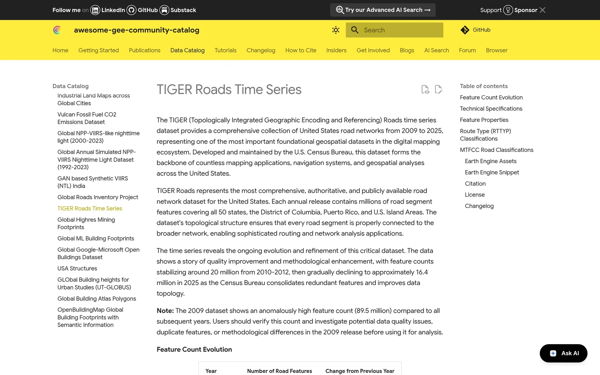
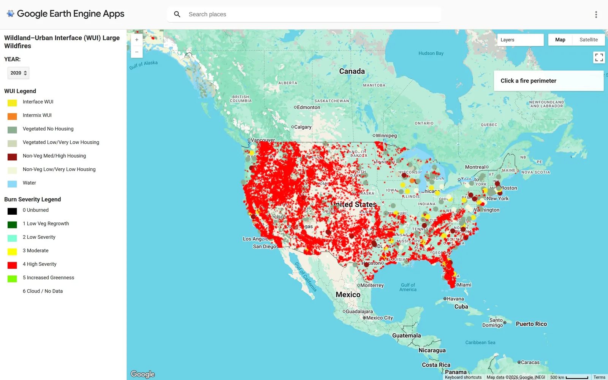
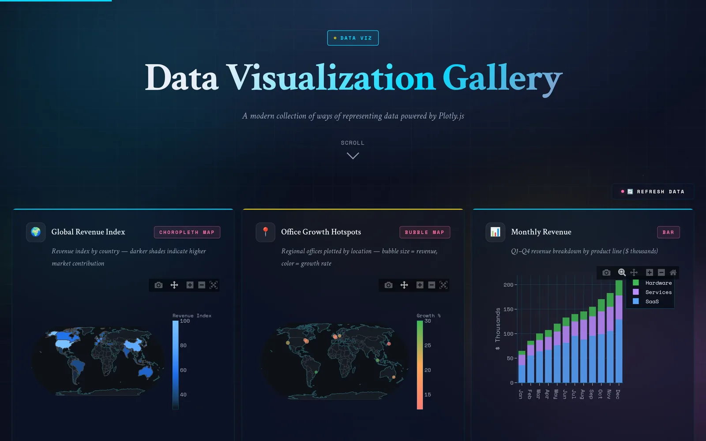
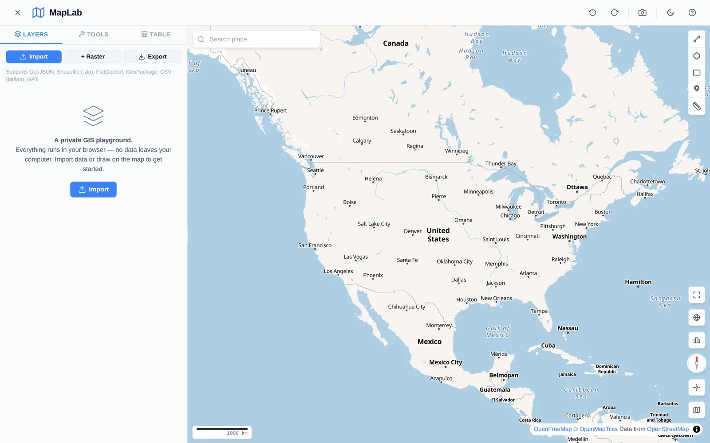
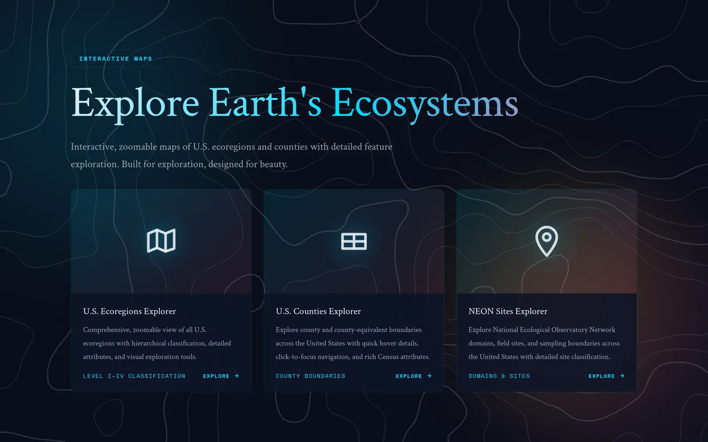
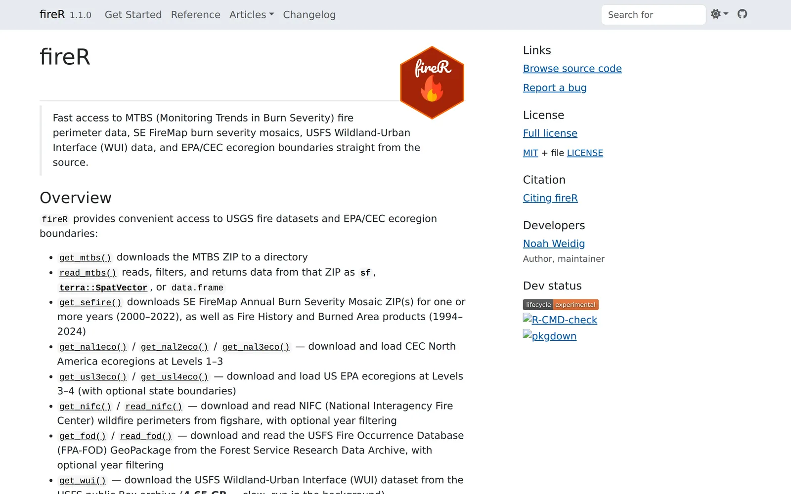
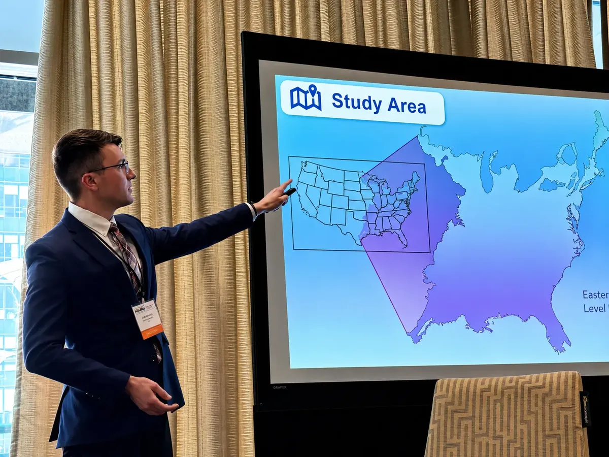
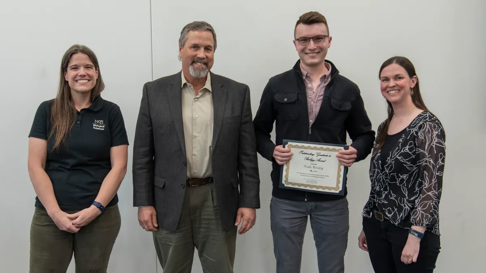

```{=html}
<section id="hero">
  <div class="nw-hero-dots" aria-hidden="true"></div>
  <div class="nw-hero-inner">
  <div class="nw-hero-text">
  <h1><span class="nw-name"><span class="nw-line nw-line-1">Spatial Analysis.</span><span class="nw-line nw-line-2">Real <span class="nw-accent">Insights</span>.</span></span></h1>
  <div class="nw-type">I build <span class="nw-typed" data-strings='["geospatial analyses","remote sensing workflows","data-driven insights","GIS applications"]'></span><span class="nw-caret">&nbsp;</span></div>
  <div class="nw-socials">
    <a href="https://www.linkedin.com/in/noahweidig/" aria-label="LinkedIn" target="_blank" rel="noopener"><svg viewBox="0 0 24 24" fill="none" stroke="currentColor" stroke-width="1.5" stroke-linecap="round" stroke-linejoin="round"><rect x="4" y="4" width="16" height="16" rx="2"/><path d="M8 11v5"/><path d="M8 8v.01"/><path d="M12 16v-5"/><path d="M16 16v-3a2 2 0 0 0 -4 0"/></svg></a>
    <a href="https://github.com/noahweidig/" aria-label="GitHub" target="_blank" rel="noopener"><svg viewBox="0 0 24 24" fill="none" stroke="currentColor" stroke-width="1.5" stroke-linecap="round" stroke-linejoin="round"><path d="M9 19c-4.3 1.4 -4.3 -2.5 -6 -3m12 5v-3.5c0 -1 .1 -1.4 -.5 -2c2.8 -.3 5.5 -1.4 5.5 -6.1a4.6 4.6 0 0 0 -1.3 -3.2a4.2 4.2 0 0 0 -.1 -3.2s-1.1 -.3 -3.5 1.3a12.3 12.3 0 0 0 -6.2 0c-2.4 -1.6 -3.5 -1.3 -3.5 -1.3a4.2 4.2 0 0 0 -.1 3.2a4.6 4.6 0 0 0 -1.3 3.2c0 4.6 2.7 5.7 5.5 6.1c-.6 .6 -.6 1.2 -.5 2v3.5"/></svg></a>
    <a href="https://scholar.google.com/citations?hl=en&user=Ml95eTwAAAAJ" aria-label="Google Scholar" target="_blank" rel="noopener"><svg viewBox="0 0 24 24" fill="none" stroke="currentColor" stroke-width="1.5" stroke-linecap="round" stroke-linejoin="round"><path d="M22 9l-10 -4l-10 4l10 4l10 -4v6"/><path d="M6 10.6v5.4a6 3 0 0 0 12 0v-5.4"/></svg></a>
    <a href="https://orcid.org/0000-0003-1205-3209" aria-label="ORCID" target="_blank" rel="noopener"><svg viewBox="0 0 24 24" fill="none" stroke="currentColor" stroke-width="1.5" stroke-linecap="round" stroke-linejoin="round"><circle cx="12" cy="12" r="9"/><path d="M9 10v6"/><path d="M9 7v.01"/><path d="M12.5 16v-6h2a3 3 0 0 1 0 6z"/></svg></a>
  </div>
  <div class="nw-btns">
    <a class="nw-btn nw-btn-primary" href="#projects">View My Work ↓</a>
    <a class="nw-btn nw-btn-ghost" href="#contact">Get In Touch <svg viewBox="0 0 24 24" fill="none" stroke="currentColor" stroke-width="1.5" stroke-linecap="round" stroke-linejoin="round" aria-hidden="true"><rect x="3" y="5" width="18" height="14" rx="2"/><path d="M3 7l9 6l9 -6"/></svg></a>
  </div>
  </div>
  <div class="nw-hero-media">
    
  </div>
  </div>
</section>

<section id="stats" class="nw-section">
  <div class="nw-section-inner">
    <div class="nw-stats">
      <div class="nw-stat"><b>25+</b><span>Papers &amp; Talks</span></div>
      <div class="nw-stat"><b>8+</b><span>Years Research Experience</span></div>
      <div class="nw-stat"><b>20+</b><span>Tools Mastered</span></div>
      <!-- The number is a fallback: scripts/update-stats.ts rewrites it at render
     time to the count of projects/*/index.qmd with `featured: true`. -->
      <div class="nw-stat"><b data-nw-stat="featured-projects">17</b><span>Featured Projects</span></div>
    </div>
    <!-- The id keeps the footer's /#affiliations link pointing at them. -->
    <div class="nw-affil-row">
      <p class="nw-affil-label">Worked with</p>
      <div class="nw-marquee" id="affiliations" role="group" aria-label="Affiliations">
        <div class="nw-marquee-track">
          <a href="https://www.ufl.edu/" target="_blank" rel="noopener"></a>
          <a href="https://www.ars.usda.gov/" target="_blank" rel="noopener"></a>
          <a href="https://www.fs.usda.gov/" target="_blank" rel="noopener"></a>
          <a href="https://www.uc.edu/" target="_blank" rel="noopener"></a>
          <a href="https://www.nku.edu/" target="_blank" rel="noopener"></a>
          <a href="https://thesca.org/" target="_blank" rel="noopener"></a>
          <a href="https://boonecountyclerk.ky.gov/" target="_blank" rel="noopener"></a>
          <a href="https://www.garageliving.com/f/cincinnati" target="_blank" rel="noopener"></a>
          <a href="https://www.instagram.com/nku_ecos/" target="_blank" rel="noopener"></a>
        </div>
      </div>
    </div>
  </div>
</section>

<section id="start" class="nw-section">
  <div class="nw-section-inner">
    <div class="nw-start-grid">
      <a class="nw-start-card" href="#interests">
        <span class="nw-start-icon"><svg viewBox="0 0 24 24" fill="none" stroke="currentColor" stroke-width="1.6" stroke-linecap="round" stroke-linejoin="round" aria-hidden="true"><path d="M3 7l6-3 6 3 6-3v13l-6 3-6-3-6 3z"/><path d="M9 4v13M15 7v13"/></svg></span>
        <h3>Research</h3>
        <p>Six focus areas, from WUI wildfire risk to species distribution modelling — with the papers behind each.</p>
        <span class="nw-start-link">Read the research →</span>
      </a>
      <a class="nw-start-card" href="#projects">
        <span class="nw-start-icon"><svg viewBox="0 0 24 24" fill="none" stroke="currentColor" stroke-width="1.6" stroke-linecap="round" stroke-linejoin="round" aria-hidden="true"><path d="M4 6a2 2 0 0 1 2-2h12a2 2 0 0 1 2 2v12a2 2 0 0 1-2 2H6a2 2 0 0 1-2-2z"/><path d="M8 9l3 3-3 3M13 15h3"/></svg></span>
        <h3>Tools &amp; maps</h3>
        <p>Open tools: an R package for U.S. fire data, Earth Engine apps, interactive map galleries.</p>
        <span class="nw-start-link">Browse the work →</span>
      </a>
      <a class="nw-start-card" href="#blog">
        <span class="nw-start-icon"><svg viewBox="0 0 24 24" fill="none" stroke="currentColor" stroke-width="1.6" stroke-linecap="round" stroke-linejoin="round" aria-hidden="true"><path d="M4 20h4L18.5 9.5a2.83 2.83 0 0 0-4-4L4 16z"/><path d="M13.5 6.5l4 4"/></svg></span>
        <h3>Writing</h3>
        <p>Tutorials and notes on R, spatial workflows, and doing reproducible research in the open.</p>
        <span class="nw-start-link">Read the blog →</span>
      </a>
    </div>
  </div>
</section>

<section id="interests" class="nw-section">
  <div class="nw-section-inner">
    <p class="nw-kicker">Research areas</p>
    <h2 class="nw-title">Where I focus my work</h2>
    <p class="nw-lead">Six threads that keep running into each other: what changed on the landscape, why, and what a decision-maker should do about it.</p>
    <!-- Each panel's figure is a system diagram built from Tabler Icons
         (MIT, tabler.io/icons) — the same set the section's eyebrow glyphs and
         the rest of the site draw from, scaled up and animated in CSS. Same
         geometry in all six, so only the glyphs change between panels. -->
    <div class="nw-areas" id="nw-areas">
      <!-- The tab strip is hidden until home.js wires it up: with no JS, every
           panel below stays visible and the section degrades to a readable
           stack rather than a row of dead buttons. -->
      <div class="nw-area-tabs" role="tablist" aria-label="Research areas" hidden>
        <button type="button" role="tab" id="nw-area-tab-remote-sensing" aria-controls="nw-area-panel-remote-sensing" aria-selected="true" tabindex="0">Remote Sensing</button>
        <button type="button" role="tab" id="nw-area-tab-land-use" aria-controls="nw-area-panel-land-use" aria-selected="false" tabindex="-1">Land-Use Change</button>
        <button type="button" role="tab" id="nw-area-tab-spatial-stats" aria-controls="nw-area-panel-spatial-stats" aria-selected="false" tabindex="-1">Spatial Statistics</button>
        <button type="button" role="tab" id="nw-area-tab-applied-ai" aria-controls="nw-area-panel-applied-ai" aria-selected="false" tabindex="-1">Applied AI</button>
        <button type="button" role="tab" id="nw-area-tab-biodiversity" aria-controls="nw-area-panel-biodiversity" aria-selected="false" tabindex="-1">Biodiversity</button>
        <button type="button" role="tab" id="nw-area-tab-geo-engineering" aria-controls="nw-area-panel-geo-engineering" aria-selected="false" tabindex="-1">Geospatial Engineering</button>
      </div>

      <div class="nw-area-panel" role="tabpanel" id="nw-area-panel-remote-sensing" aria-labelledby="nw-area-tab-remote-sensing">
        <div class="nw-area-copy">
          <p class="nw-area-eyebrow"><span class="nw-icon"><svg viewBox="0 0 24 24" fill="none" stroke="currentColor" stroke-width="1.5" stroke-linecap="round" stroke-linejoin="round"><path d="M3.707 6.293l2.586 -2.586a1 1 0 0 1 1.414 0l5.586 5.586a1 1 0 0 1 0 1.414l-2.586 2.586a1 1 0 0 1 -1.414 0l-5.586 -5.586a1 1 0 0 1 0 -1.414z"/><path d="M6 10l-3 3l3 3l3 -3"/><path d="M10 6l3 -3l3 3l-3 3"/><path d="M12 12l1.5 1.5"/><path d="M14.5 17a2.5 2.5 0 0 0 2.5 -2.5"/><path d="M15 21a6 6 0 0 0 6 -6"/></svg></span>Remote Sensing &amp; Earth Observation</p>
          <h3>Seeing change from orbit.</h3>
          <p>Multi-temporal satellite imagery turned into measurable change — classification, spectral indices, and time-series analysis at landscape scale in Google Earth Engine.</p>
          <div class="nw-chips"><span class="nw-chip">Imagery Analysis</span><span class="nw-chip">Google Earth Engine</span><span class="nw-chip">Change Detection</span></div>
        </div>
        <figure class="nw-area-fig">
          
          <figcaption>TIGER roads &middot; Google Earth Engine</figcaption>
        </figure>
      </div>

      <div class="nw-area-panel" role="tabpanel" id="nw-area-panel-land-use" aria-labelledby="nw-area-tab-land-use">
        <div class="nw-area-copy">
          <p class="nw-area-eyebrow"><span class="nw-icon"><svg viewBox="0 0 24 24" fill="none" stroke="currentColor" stroke-width="1.5" stroke-linecap="round" stroke-linejoin="round"><path d="M3 7l6 -3l6 3l6 -3v13l-6 3l-6 -3l-6 3z"/><path d="M9 4v13"/><path d="M15 7v13"/></svg></span>Land-Use Change &amp; Social-Ecological Systems</p>
          <h3>Where people and landscapes meet.</h3>
          <p>Modeling how development, disturbance, and policy reshape land cover, with a focus on wildfire risk in the wildland–urban interface.</p>
          <div class="nw-chips"><span class="nw-chip">Land-Use Change</span><span class="nw-chip">Wildfire &amp; WUI</span><span class="nw-chip">Risk Assessment</span></div>
        </div>
        <figure class="nw-area-fig">
          
          <figcaption>WUI wildfire risk &middot; thesis chapter 2</figcaption>
        </figure>
      </div>

      <div class="nw-area-panel" role="tabpanel" id="nw-area-panel-spatial-stats" aria-labelledby="nw-area-tab-spatial-stats">
        <div class="nw-area-copy">
          <p class="nw-area-eyebrow"><span class="nw-icon"><svg viewBox="0 0 24 24" fill="none" stroke="currentColor" stroke-width="1.5" stroke-linecap="round" stroke-linejoin="round"><path d="M3 13a1 1 0 0 1 1 -1h2a1 1 0 0 1 1 1v6a1 1 0 0 1 -1 1h-2a1 1 0 0 1 -1 -1z"/><path d="M10 9a1 1 0 0 1 1 -1h2a1 1 0 0 1 1 1v10a1 1 0 0 1 -1 1h-2a1 1 0 0 1 -1 -1z"/><path d="M17 5a1 1 0 0 1 1 -1h2a1 1 0 0 1 1 1v14a1 1 0 0 1 -1 1h-2a1 1 0 0 1 -1 -1z"/></svg></span>Spatial Data Science &amp; Statistical Modeling</p>
          <h3>Uncertainty, stated honestly.</h3>
          <p>Bayesian and spatial-statistical models that quantify what the data actually support, in reproducible pipelines anyone can rerun.</p>
          <div class="nw-chips"><span class="nw-chip">Bayesian Analysis</span><span class="nw-chip">Forecasting</span><span class="nw-chip">Reproducible Research</span></div>
        </div>
        <figure class="nw-area-fig">
          
          <figcaption>Posterior summaries &middot; R + Plotly</figcaption>
        </figure>
      </div>

      <div class="nw-area-panel" role="tabpanel" id="nw-area-panel-applied-ai" aria-labelledby="nw-area-tab-applied-ai">
        <div class="nw-area-copy">
          <p class="nw-area-eyebrow"><span class="nw-icon"><svg viewBox="0 0 24 24" fill="none" stroke="currentColor" stroke-width="1.5" stroke-linecap="round" stroke-linejoin="round"><path d="M16 18a2 2 0 0 1 2 2a2 2 0 0 1 2 -2a2 2 0 0 1 -2 -2a2 2 0 0 1 -2 2z"/><path d="M16 6a2 2 0 0 1 2 2a2 2 0 0 1 2 -2a2 2 0 0 1 -2 -2a2 2 0 0 1 -2 2z"/><path d="M9 18a6 6 0 0 1 6 -6a6 6 0 0 1 -6 -6a6 6 0 0 1 -6 6a6 6 0 0 1 6 6z"/></svg></span>Applied AI &amp; Data Storytelling</p>
          <h3>Models that reach a decision-maker.</h3>
          <p>Machine learning applied to ecological and geospatial problems, paired with visualization that makes the result legible to non-specialists.</p>
          <div class="nw-chips"><span class="nw-chip">Machine Learning</span><span class="nw-chip">Data Visualization</span><span class="nw-chip">Quantitative Ecology</span></div>
        </div>
        <figure class="nw-area-fig">
          
          <figcaption>MapLab &middot; GIS for non-GIS users</figcaption>
        </figure>
      </div>

      <div class="nw-area-panel" role="tabpanel" id="nw-area-panel-biodiversity" aria-labelledby="nw-area-tab-biodiversity">
        <div class="nw-area-copy">
          <p class="nw-area-eyebrow"><span class="nw-icon"><svg viewBox="0 0 24 24" fill="none" stroke="currentColor" stroke-width="1.5" stroke-linecap="round" stroke-linejoin="round"><path d="M5 21c.5 -4.5 2.5 -8 7 -10"/><path d="M9 18c6.218 0 10.5 -3.288 11 -12v-2h-4.014c-9 0 -11.986 4 -12 9c0 1 0 3 2 5h3z"/></svg></span>Biodiversity &amp; Conservation Monitoring</p>
          <h3>Mapping what lives where.</h3>
          <p>Species distribution models and habitat mapping that turn scattered occurrence records into conservation-planning inputs.</p>
          <div class="nw-chips"><span class="nw-chip">Species Distribution</span><span class="nw-chip">Habitat Mapping</span><span class="nw-chip">Conservation Planning</span></div>
        </div>
        <figure class="nw-area-fig">
          
          <figcaption>Habitat suitability &middot; map gallery</figcaption>
        </figure>
      </div>

      <div class="nw-area-panel" role="tabpanel" id="nw-area-panel-geo-engineering" aria-labelledby="nw-area-tab-geo-engineering">
        <div class="nw-area-copy">
          <p class="nw-area-eyebrow"><span class="nw-icon"><svg viewBox="0 0 24 24" fill="none" stroke="currentColor" stroke-width="1.5" stroke-linecap="round" stroke-linejoin="round"><ellipse cx="12" cy="6" rx="8" ry="3"/><path d="M4 6v6a8 3 0 0 0 16 0v-6"/><path d="M4 12v6a8 3 0 0 0 16 0v-6"/></svg></span>Geospatial Engineering &amp; Open Data</p>
          <h3>Infrastructure for spatial work.</h3>
          <p>Spatial databases, automated data pipelines, and open-source GIS tooling that keep analysis fast, current, and shareable.</p>
          <div class="nw-chips"><span class="nw-chip">Spatial Databases</span><span class="nw-chip">Data Pipelines</span><span class="nw-chip">Open Source GIS</span></div>
        </div>
        <figure class="nw-area-fig">
          
          <figcaption>fireR &middot; R package for U.S. fire data</figcaption>
        </figure>
      </div>
    </div>
  </div>
</section>
```

::: {.nw-section #projects}
::: {.nw-section-inner}
<div class="nw-head-row">
<div>
<p class="nw-kicker">Selected work</p>
<h2 class="nw-title">Tools, maps &amp; applications</h2>
</div>
<a class="nw-head-link" href="projects/">Browse All Projects →</a>
</div>

::: {#featured-projects .nw-projects}
:::
:::
:::

::: {.nw-section #publications}
::: {.nw-section-inner}
<div class="nw-head-row">
<div>
<p class="nw-kicker">Publications</p>
<h2 class="nw-title">Peer-reviewed &amp; in review</h2>
</div>
<a class="nw-head-link" href="publications/">All Publications →</a>
</div>

::: {#featured-pubs .nw-cites}
:::
:::
:::

```{=html}
<section id="skills" class="nw-section">
  <div class="nw-section-inner">
    <p class="nw-kicker">Tech stack</p>
    <h2 class="nw-title">Technologies I use to build things</h2>
    <!-- One continuous strip rather than category cards: the tools read as a
         single toolkit, and it matches the affiliation marquee under the
         stats. Icons sit grey and come to full color on hover. -->
    <div class="nw-marquee nw-marquee-tech" role="group" aria-label="Tech stack">
      <div class="nw-marquee-track">
        <span class="nw-tech-item">R</span>
        <span class="nw-tech-item">Python</span>
        <span class="nw-tech-item">JavaScript</span>
        <span class="nw-tech-item">SQL</span>
        <span class="nw-tech-item">Markdown</span>
        <span class="nw-tech-item">LaTeX</span>
        <span class="nw-tech-item">HTML</span>
        <span class="nw-tech-item">CSS</span>
        <span class="nw-tech-item">Git</span>
        <span class="nw-tech-item">GitHub</span>
        <span class="nw-tech-item">Actions</span>
        <span class="nw-tech-item">Conda</span>
        <span class="nw-tech-item">tidyverse</span>
        <span class="nw-tech-item">pandas</span>
        <span class="nw-tech-item">NumPy</span>
        <span class="nw-tech-item">Plotly</span>
        <span class="nw-tech-item">ArcGIS Pro</span>
        <span class="nw-tech-item">GEE</span>
        <span class="nw-tech-item">QGIS</span>
        <span class="nw-tech-item">GDAL</span>
        <span class="nw-tech-item">sf</span>
        <span class="nw-tech-item">terra</span>
        <span class="nw-tech-item">GeoPandas</span>
        <span class="nw-tech-item">OSM</span>
      </div>
    </div>
  </div>
</section>

<section id="experience" class="nw-section">
  <div class="nw-section-inner">
    <p class="nw-kicker">Background</p>
    <h2 class="nw-title">Where I've worked and studied</h2>
    <div class="nw-exp-edu-grid">
      <div class="nw-exp-edu-col">
        <h3 class="nw-exp-edu-label">Experience</h3>
        <div class="nw-timeline">
          <a class="nw-tl-item nw-tl-link" href="experience/uf-gis-associate/">
            <h4>GIS &amp; Remote Sensing Research Associate</h4>
            <div class="nw-tl-org">University of Florida</div>
            <div class="nw-tl-meta">Aug 2025 – Present · Milton, FL</div>
            <p>Led GIS-based analysis assessing spatial patterns and land-use impacts on community and regional risk management</p>
          </a>
          <a class="nw-tl-item nw-tl-link" href="experience/uf-grad-research/">
            <h4>Graduate Research Assistant</h4>
            <div class="nw-tl-org">University of Florida</div>
            <div class="nw-tl-meta">Aug 2023 – Aug 2025 · Milton, FL</div>
            <p>Conducted geospatial analysis to support wildland-urban interface and emergency management decision-making</p>
          </a>
        </div>
        <div class="nw-btns nw-section-more"><a class="nw-btn nw-btn-ghost" href="experience/">See All Experience →</a></div>
      </div>
      <div class="nw-exp-edu-col" id="education">
        <h3 class="nw-exp-edu-label">Education</h3>
        <div class="nw-timeline">
          <a class="nw-tl-item nw-tl-link" href="education/uf-masters/">
            <h4>Master of Science, Forest Resources &amp; Conservation</h4>
            <div class="nw-tl-org">University of Florida</div>
            <div class="nw-tl-meta">Aug 2023 – Aug 2025</div>
            <p>Thesis: Large Wildfire Patterns in the WUI, 4.0 GPA</p>
          </a>
          <a class="nw-tl-item nw-tl-link" href="education/nku-bachelors/">
            <h4>Bachelor of Science, Biological Sciences</h4>
            <div class="nw-tl-org">Northern Kentucky University</div>
            <div class="nw-tl-meta">Aug 2018 – May 2022</div>
            <p>Ecology, Evolution, &amp; Organismal Track, 4.0 GPA</p>
          </a>
        </div>
        <div class="nw-btns nw-section-more"><a class="nw-btn nw-btn-ghost" href="education/">See All Education →</a></div>
      </div>
    </div>
  </div>
</section>

<section id="awards" class="nw-section">
  <div class="nw-section-inner">
    <div class="nw-head-row">
      <div>
        <p class="nw-kicker">Recognition</p>
        <h2 class="nw-title">Featured Awards</h2>
      </div>
      <a class="nw-head-link" href="awards/">All Awards →</a>
    </div>
    <div class="nw-carousel">
      <a class="nw-award" href="awards/outstanding-thesis-natural-resources/"><figure><figcaption><b>Outstanding Thesis in Natural Resources</b><span>University of Florida, College of Agricultural &amp; Life Sciences</span></figcaption></figure></a>
      <a class="nw-award" href="awards/outstanding-thesis-forest-resources/"><figure><figcaption><b>Outstanding Thesis in Forest Resources &amp; Conservation</b><span>University of Florida, School of Forest, Fisheries, &amp; Geomatic Sciences</span></figcaption></figure></a>
      <a class="nw-award" href="awards/best-student-presentation/"><figure><figcaption><b>Best Student Presentation</b><span>International Association of Landscape Ecology – North America</span></figcaption></figure></a>
      <a class="nw-award" href="awards/outstanding-graduate-biology/"><figure><figcaption><b>Outstanding Graduate in Biology</b><span>Northern Kentucky University, Department of Biological Sciences</span></figcaption></figure></a>
    </div>
  </div>
</section>
```

::: {.nw-section #blog}
::: {.nw-section-inner}
<div class="nw-head-row">
<div>
<p class="nw-kicker">Writing</p>
<h2 class="nw-title">Notes &amp; tutorials</h2>
</div>
<a class="nw-head-link" href="blog/">Read More Posts →</a>
</div>

::: {#featured-posts .nw-posts}
:::
:::
:::

```{=html}
<section id="faq" class="nw-section">
  <div class="nw-section-inner">
    <p class="nw-kicker">FAQ</p>
    <h2 class="nw-title">About My Work</h2>
    <p class="nw-subtitle">Common questions about collaboration and what I do</p>
    <div class="nw-faq">
      <details><summary>What do you do?</summary><p>I work at the intersection of geospatial analytics, data science, and applied AI — building reproducible workflows that turn spatial and environmental data into decision-ready insights.</p></details>
      <details><summary>What kinds of projects are you interested in?</summary><p>I'm drawn to work involving remote sensing, land-use change, social-ecological systems, and data storytelling. I especially enjoy projects where rigorous analysis meets clear visual communication.</p></details>
      <details><summary>Are you open to collaboration?</summary><p>Yes. I'm happy to discuss research collaborations, freelance work, and full-time opportunities in data science or GIS. The best way to start a conversation is through the contact section below.</p></details>
      <details><summary>What tools do you typically work with?</summary><p>Mostly R and Python for analysis and modeling, alongside SQL for data wrangling and a range of GIS tools (ArcGIS Pro, QGIS, GEE, GDAL) for spatial work. See the tech stack section for the full toolkit.</p></details>
      <details><summary>How can I get in touch?</summary><p>Email is the easiest — you'll find it in the contact section just below this one.</p></details>
    </div>
  </div>
</section>

<section id="contact" class="nw-section">
  <div class="nw-section-inner">
    <h2 class="nw-title">Get In Touch</h2>
    <p class="nw-subtitle">Let's build something amazing together</p>
    <div class="nw-contact-card">
      <div class="nw-contact-info">
        <h3>Let's start a conversation</h3>
        <p>I'm always interested in hearing about new projects and opportunities. Whether you're looking to hire, collaborate, or just want to say hi, feel free to reach out!</p>
        <ul class="nw-contact-list">
          <li>
            <span class="nw-contact-icon"><svg viewBox="0 0 24 24" fill="none" stroke="currentColor" stroke-width="1.5" stroke-linecap="round" stroke-linejoin="round" aria-hidden="true"><rect x="3" y="5" width="18" height="14" rx="2"/><path d="M3 7l9 6l9 -6"/></svg></span>
            <span class="nw-contact-item"><small>Email</small><a href="mailto:noah@noahweidig.com">noah@noahweidig.com</a></span>
          </li>
          <li>
            <span class="nw-contact-icon"><svg viewBox="0 0 24 24" fill="none" stroke="currentColor" stroke-width="1.5" stroke-linecap="round" stroke-linejoin="round" aria-hidden="true"><path d="M9 11a3 3 0 1 0 6 0a3 3 0 0 0 -6 0"/><path d="M17.657 16.657l-4.243 4.243a2 2 0 0 1 -2.827 0l-4.244 -4.243a8 8 0 1 1 11.314 0z"/></svg></span>
            <span class="nw-contact-item"><small>Location</small><span>Orlando, Florida</span></span>
          </li>
          <li>
            <span class="nw-contact-icon"><svg viewBox="0 0 24 24" fill="none" stroke="currentColor" stroke-width="1.5" stroke-linecap="round" stroke-linejoin="round" aria-hidden="true"><rect x="3" y="7" width="18" height="13" rx="2"/><path d="M8 7v-2a2 2 0 0 1 2 -2h4a2 2 0 0 1 2 2v2"/><path d="M12 12v.01"/><path d="M3 13a20 20 0 0 0 18 0"/></svg></span>
            <span class="nw-contact-item"><small>Open to</small><span>Data science &amp; GIS roles, collaborations</span></span>
          </li>
        </ul>
      </div>
      <form class="nw-form" action="https://formspree.io/f/xjgnggga" method="POST" aria-describedby="nw-form-status">
        <label class="nw-sr-only" for="nw-form-name">Your name</label>
        <input id="nw-form-name" type="text" name="name" placeholder="Your name" autocomplete="name" required>
        <label class="nw-sr-only" for="nw-form-email">Your email</label>
        <input id="nw-form-email" type="email" name="email" placeholder="Your email" autocomplete="email" required>
        <label class="nw-sr-only" for="nw-form-message">Your message</label>
        <textarea id="nw-form-message" name="message" rows="5" placeholder="Your message" required></textarea>
        <p class="nw-form-status" id="nw-form-status" role="status" aria-live="polite" hidden></p>
        <div class="nw-btns"><button class="nw-btn nw-btn-primary" type="submit">Send Message</button></div>
      </form>
    </div>
  </div>
</section>

<section id="cta" class="nw-section">
  <div class="nw-section-inner nw-cta-layout">
    <div class="nw-cta-card">
      <span class="nw-cta-status">Open to data science &amp; GIS roles</span>
      <h2>Let's talk about spatial problems worth solving.</h2>
      <p>I'm looking for <strong>data scientist</strong> and <strong>GIS analyst</strong> roles where rigorous spatial analysis drives real decisions. If that's the kind of work your team is doing, let's talk.</p>
      <ul class="nw-cta-facts">
        <li><svg viewBox="0 0 24 24" fill="none" stroke="currentColor" stroke-width="1.5" stroke-linecap="round" stroke-linejoin="round" aria-hidden="true"><path d="M9 11a3 3 0 1 0 6 0a3 3 0 0 0 -6 0"/><path d="M17.657 16.657l-4.243 4.243a2 2 0 0 1 -2.827 0l-4.244 -4.243a8 8 0 1 1 11.314 0z"/></svg>Orlando, FL &middot; Remote-friendly</li>
        <li><svg viewBox="0 0 24 24" fill="none" stroke="currentColor" stroke-width="1.5" stroke-linecap="round" stroke-linejoin="round" aria-hidden="true"><path d="M12 3l8 4.5v9l-8 4.5l-8 -4.5v-9z"/><path d="M12 12l8 -4.5"/><path d="M12 12v9"/><path d="M12 12l-8 -4.5"/></svg>Data science, GIS &amp; applied AI</li>
        <li><svg viewBox="0 0 24 24" fill="none" stroke="currentColor" stroke-width="1.5" stroke-linecap="round" stroke-linejoin="round" aria-hidden="true"><path d="M12 7v5l3 3"/><path d="M12 3a9 9 0 1 0 0 18a9 9 0 0 0 0 -18"/></svg>Replies within 24 hours</li>
      </ul>
      <div class="nw-btns"><a class="nw-btn nw-btn-primary" href="uploads/resume.pdf" target="_blank" rel="noopener"><svg viewBox="0 0 24 24" fill="none" stroke="currentColor" stroke-width="1.5" stroke-linecap="round" stroke-linejoin="round" aria-hidden="true"><path d="M4 17v2a2 2 0 0 0 2 2h12a2 2 0 0 0 2 -2v-2"/><path d="M7 11l5 5l5 -5"/><path d="M12 4v12"/></svg>Download Resume</a><a class="nw-btn nw-btn-ghost" href="/cv.html">View Full CV</a><a class="nw-btn nw-btn-ghost" href="mailto:noah@noahweidig.com">Get in Touch</a></div>
      <p class="nw-cta-foot">Prefer email? Reach me directly at <a href="mailto:noah@noahweidig.com" style="color:inherit;font-weight:600;">noah@noahweidig.com</a></p>
    </div>
    <!-- The dot globe rides alongside the closing pitch: to its right on
         desktop, stacked underneath once the section goes single-column. -->
    <div class="nw-globe-wrap" id="map">
      <div class="nw-globe-card">
        <div class="nw-globe-frame">
          <canvas id="nw-globe" aria-hidden="true"></canvas>
          <div class="nw-globe-label" id="nw-globe-label" hidden><b>Orlando, Florida</b><code>28.5384&deg; N, 81.3789&deg; W</code></div>
        </div>
      </div>
    </div>
  </div>
</section>
```
