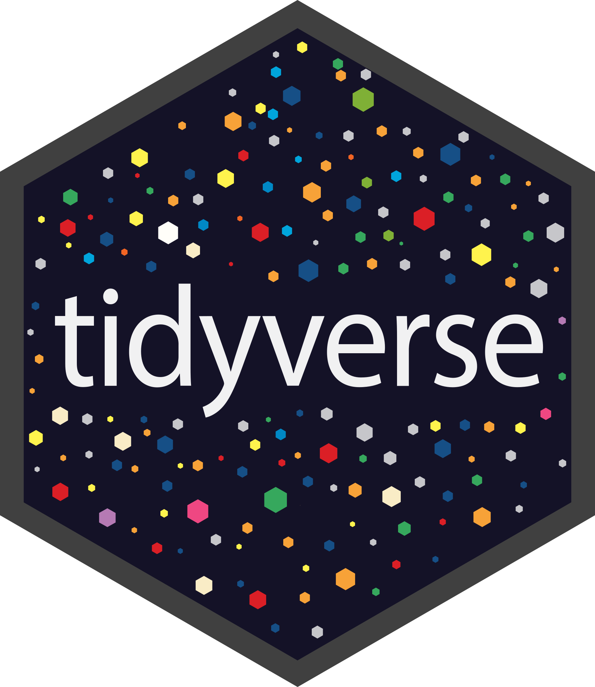
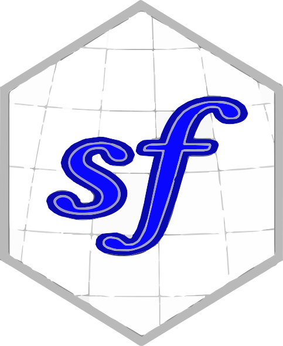
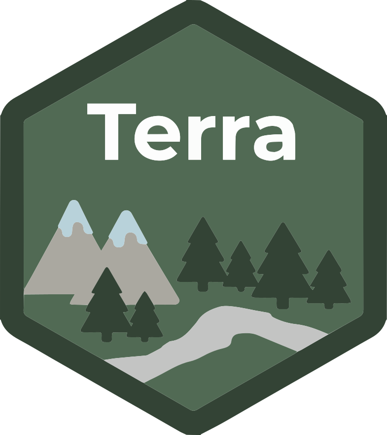
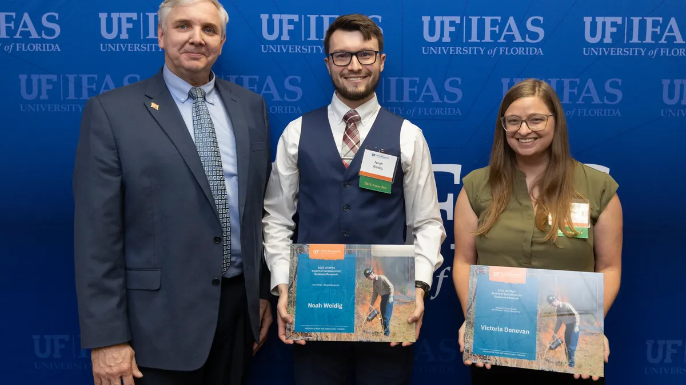
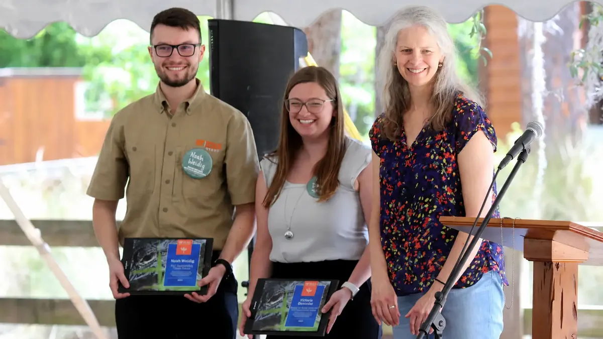

```{=html}
<section id="hero">
  <div id="nw-particles" aria-hidden="true"></div>
  <div class="nw-hero-inner">
  <div class="nw-hero-text">
  <h1><span class="nw-name"><span class="nw-line nw-line-1">Spatial Analysis.</span><span class="nw-line nw-line-2">Real <span class="nw-accent">Insights</span>.</span></span></h1>
  <div class="nw-type">I build <span class="nw-typed" data-strings='["geospatial analyses","remote sensing workflows","data-driven insights","GIS applications"]'></span><span class="nw-caret">&nbsp;</span></div>
  <div class="nw-socials">
    <a href="https://www.linkedin.com/in/noahweidig/" aria-label="LinkedIn" target="_blank" rel="noopener"><svg viewBox="0 0 24 24" fill="none" stroke="currentColor" stroke-width="1.5" stroke-linecap="round" stroke-linejoin="round"><rect x="4" y="4" width="16" height="16" rx="2"/><path d="M8 11v5"/><path d="M8 8v.01"/><path d="M12 16v-5"/><path d="M16 16v-3a2 2 0 0 0 -4 0"/></svg></a>
    <a href="https://github.com/noahweidig/" aria-label="GitHub" target="_blank" rel="noopener"><svg viewBox="0 0 24 24" fill="none" stroke="currentColor" stroke-width="1.5" stroke-linecap="round" stroke-linejoin="round"><path d="M9 19c-4.3 1.4 -4.3 -2.5 -6 -3m12 5v-3.5c0 -1 .1 -1.4 -.5 -2c2.8 -.3 5.5 -1.4 5.5 -6.1a4.6 4.6 0 0 0 -1.3 -3.2a4.2 4.2 0 0 0 -.1 -3.2s-1.1 -.3 -3.5 1.3a12.3 12.3 0 0 0 -6.2 0c-2.4 -1.6 -3.5 -1.3 -3.5 -1.3a4.2 4.2 0 0 0 -.1 3.2a4.6 4.6 0 0 0 -1.3 3.2c0 4.6 2.7 5.7 5.5 6.1c-.6 .6 -.6 1.2 -.5 2v3.5"/></svg></a>
    <a href="https://scholar.google.com/citations?hl=en&user=Ml95eTwAAAAJ" aria-label="Google Scholar" target="_blank" rel="noopener"><svg viewBox="0 0 24 24" fill="none" stroke="currentColor" stroke-width="1.5" stroke-linecap="round" stroke-linejoin="round"><path d="M22 9l-10 -4l-10 4l10 4l10 -4v6"/><path d="M6 10.6v5.4a6 3 0 0 0 12 0v-5.4"/></svg></a>
    <a href="https://orcid.org/0000-0003-1205-3209" aria-label="ORCID" target="_blank" rel="noopener"><svg viewBox="0 0 24 24" fill="none" stroke="currentColor" stroke-width="1.5" stroke-linecap="round" stroke-linejoin="round"><circle cx="12" cy="12" r="9"/><path d="M9 10v6"/><path d="M9 7v.01"/><path d="M12.5 16v-6h2a3 3 0 0 1 0 6z"/></svg></a>
  </div>
  <div class="nw-btns">
    <a class="nw-btn nw-btn-primary" href="#projects">View My Work ↓</a>
    <a class="nw-btn nw-btn-ghost" href="#contact">Get In Touch <svg viewBox="0 0 24 24" fill="none" stroke="currentColor" stroke-width="1.5" stroke-linecap="round" stroke-linejoin="round" aria-hidden="true"><rect x="3" y="5" width="18" height="14" rx="2"/><path d="M3 7l9 6l9 -6"/></svg></a>
  </div>
  </div>
  <div class="nw-hero-media">
    
  </div>
  </div>
</section>

<section id="stats" class="nw-section">
  <div class="nw-section-inner">
    <div class="nw-stats">
      <div class="nw-stat"><b>25+</b><span>Papers &amp; Talks</span></div>
      <div class="nw-stat"><b>8+</b><span>Years Research Experience</span></div>
      <div class="nw-stat"><b>20+</b><span>Tools Mastered</span></div>
      <!-- The number is a fallback: scripts/update-stats.ts rewrites it at render
     time to the count of projects/*/index.qmd with `featured: true`. -->
      <div class="nw-stat"><b data-nw-stat="featured-projects">17</b><span>Featured Projects</span></div>
    </div>
    <!-- Affiliation logos: icons only, no heading — they read as a quiet
         credential strip under the stats. The id keeps the footer's
         /#affiliations link pointing at them. -->
    <div class="nw-marquee" id="affiliations" role="group" aria-label="Affiliations">
      <div class="nw-marquee-track">
        <a href="https://www.ufl.edu/" target="_blank" rel="noopener"></a>
        <a href="https://www.ars.usda.gov/" target="_blank" rel="noopener"></a>
        <a href="https://www.fs.usda.gov/" target="_blank" rel="noopener"></a>
        <a href="https://www.uc.edu/" target="_blank" rel="noopener"></a>
        <a href="https://www.nku.edu/" target="_blank" rel="noopener"></a>
        <a href="https://thesca.org/" target="_blank" rel="noopener"></a>
        <a href="https://boonecountyclerk.ky.gov/" target="_blank" rel="noopener"></a>
        <a href="https://www.garageliving.com/f/cincinnati" target="_blank" rel="noopener"></a>
        <a href="https://www.instagram.com/nku_ecos/" target="_blank" rel="noopener"></a>
      </div>
    </div>
  </div>
</section>

<section id="interests" class="nw-section nw-alt">
  <div class="nw-section-inner">
    <h2 class="nw-title">Research Areas</h2>
    <p class="nw-subtitle">Where I focus my work</p>
    <p class="nw-lead">I work at the intersection of geospatial analytics, data science, and applied AI — turning spatial and environmental data into decision-ready insight.</p>
    <div class="nw-grid">
      <div class="nw-card">
        <span class="nw-icon"><svg viewBox="0 0 24 24" fill="none" stroke="currentColor" stroke-width="1.5" stroke-linecap="round" stroke-linejoin="round"><path d="M3.707 6.293l2.586 -2.586a1 1 0 0 1 1.414 0l5.586 5.586a1 1 0 0 1 0 1.414l-2.586 2.586a1 1 0 0 1 -1.414 0l-5.586 -5.586a1 1 0 0 1 0 -1.414z"/><path d="M6 10l-3 3l3 3l3 -3"/><path d="M10 6l3 -3l3 3l-3 3"/><path d="M12 12l1.5 1.5"/><path d="M14.5 17a2.5 2.5 0 0 0 2.5 -2.5"/><path d="M15 21a6 6 0 0 0 6 -6"/></svg></span>
        <h3>Remote Sensing &amp; Earth Observation</h3>
        <div class="nw-chips"><span class="nw-chip">Imagery Analysis</span><span class="nw-chip">Google Earth Engine</span><span class="nw-chip">Change Detection</span></div>
      </div>
      <div class="nw-card">
        <span class="nw-icon"><svg viewBox="0 0 24 24" fill="none" stroke="currentColor" stroke-width="1.5" stroke-linecap="round" stroke-linejoin="round"><path d="M3 7l6 -3l6 3l6 -3v13l-6 3l-6 -3l-6 3z"/><path d="M9 4v13"/><path d="M15 7v13"/></svg></span>
        <h3>Land-Use Change &amp; Social-Ecological Systems</h3>
        <div class="nw-chips"><span class="nw-chip">Land-Use Change</span><span class="nw-chip">Wildfire &amp; WUI</span><span class="nw-chip">Risk Assessment</span></div>
      </div>
      <div class="nw-card">
        <span class="nw-icon"><svg viewBox="0 0 24 24" fill="none" stroke="currentColor" stroke-width="1.5" stroke-linecap="round" stroke-linejoin="round"><path d="M3 13a1 1 0 0 1 1 -1h2a1 1 0 0 1 1 1v6a1 1 0 0 1 -1 1h-2a1 1 0 0 1 -1 -1z"/><path d="M10 9a1 1 0 0 1 1 -1h2a1 1 0 0 1 1 1v10a1 1 0 0 1 -1 1h-2a1 1 0 0 1 -1 -1z"/><path d="M17 5a1 1 0 0 1 1 -1h2a1 1 0 0 1 1 1v14a1 1 0 0 1 -1 1h-2a1 1 0 0 1 -1 -1z"/></svg></span>
        <h3>Spatial Data Science &amp; Statistical Modeling</h3>
        <div class="nw-chips"><span class="nw-chip">Bayesian Analysis</span><span class="nw-chip">Forecasting</span><span class="nw-chip">Reproducible Research</span></div>
      </div>
      <div class="nw-card">
        <span class="nw-icon"><svg viewBox="0 0 24 24" fill="none" stroke="currentColor" stroke-width="1.5" stroke-linecap="round" stroke-linejoin="round"><path d="M16 18a2 2 0 0 1 2 2a2 2 0 0 1 2 -2a2 2 0 0 1 -2 -2a2 2 0 0 1 -2 2z"/><path d="M16 6a2 2 0 0 1 2 2a2 2 0 0 1 2 -2a2 2 0 0 1 -2 -2a2 2 0 0 1 -2 2z"/><path d="M9 18a6 6 0 0 1 6 -6a6 6 0 0 1 -6 -6a6 6 0 0 1 -6 6a6 6 0 0 1 6 6z"/></svg></span>
        <h3>Applied AI &amp; Data Storytelling</h3>
        <div class="nw-chips"><span class="nw-chip">Machine Learning</span><span class="nw-chip">Data Visualization</span><span class="nw-chip">Quantitative Ecology</span></div>
      </div>
      <div class="nw-card">
        <span class="nw-icon"><svg viewBox="0 0 24 24" fill="none" stroke="currentColor" stroke-width="1.5" stroke-linecap="round" stroke-linejoin="round"><path d="M5 21c.5 -4.5 2.5 -8 7 -10"/><path d="M9 18c6.218 0 10.5 -3.288 11 -12v-2h-4.014c-9 0 -11.986 4 -12 9c0 1 0 3 2 5h3z"/></svg></span>
        <h3>Biodiversity &amp; Conservation Monitoring</h3>
        <div class="nw-chips"><span class="nw-chip">Species Distribution</span><span class="nw-chip">Habitat Mapping</span><span class="nw-chip">Conservation Planning</span></div>
      </div>
      <div class="nw-card">
        <span class="nw-icon"><svg viewBox="0 0 24 24" fill="none" stroke="currentColor" stroke-width="1.5" stroke-linecap="round" stroke-linejoin="round"><ellipse cx="12" cy="6" rx="8" ry="3"/><path d="M4 6v6a8 3 0 0 0 16 0v-6"/><path d="M4 12v6a8 3 0 0 0 16 0v-6"/></svg></span>
        <h3>Geospatial Engineering &amp; Open Data</h3>
        <div class="nw-chips"><span class="nw-chip">Spatial Databases</span><span class="nw-chip">Data Pipelines</span><span class="nw-chip">Open Source GIS</span></div>
      </div>
    </div>
  </div>
</section>
```

::: {.nw-section #projects}
::: {.nw-section-inner}
<h2 class="nw-title">Featured Projects</h2>
<p class="nw-subtitle">A selection of my recent work</p>

::: {#featured-projects .nw-projects}
:::

<div class="nw-btns nw-section-more"><a class="nw-btn nw-btn-ghost" href="projects/">Browse All Projects →</a></div>
:::
:::

::: {.nw-section .nw-alt .nw-wash-l #publications}
::: {.nw-section-inner}
<h2 class="nw-title">Featured Publications</h2>
<p class="nw-subtitle">Recent journal articles</p>

::: {#featured-pubs .nw-cites}
:::

<div class="nw-btns nw-section-more"><a class="nw-btn nw-btn-ghost" href="publications/">See More Publications →</a></div>
:::
:::

```{=html}
<section id="skills" class="nw-section">
  <div class="nw-section-inner">
    <h2 class="nw-title">Tech Stack</h2>
    <p class="nw-subtitle">Technologies I use to build things</p>
    <!-- One continuous strip rather than category cards: the tools read as a
         single toolkit, and it matches the affiliation marquee under the
         stats. Icons sit grey and come to full color on hover. -->
    <div class="nw-marquee nw-marquee-tech" role="group" aria-label="Tech stack">
      <div class="nw-marquee-track">
        <span class="nw-tech-item">R</span>
        <span class="nw-tech-item">Python</span>
        <span class="nw-tech-item">JavaScript</span>
        <span class="nw-tech-item">SQL</span>
        <span class="nw-tech-item">Markdown</span>
        <span class="nw-tech-item">LaTeX</span>
        <span class="nw-tech-item">HTML</span>
        <span class="nw-tech-item">CSS</span>
        <span class="nw-tech-item">Git</span>
        <span class="nw-tech-item">GitHub</span>
        <span class="nw-tech-item">Actions</span>
        <span class="nw-tech-item">Conda</span>
        <span class="nw-tech-item">tidyverse</span>
        <span class="nw-tech-item">pandas</span>
        <span class="nw-tech-item">NumPy</span>
        <span class="nw-tech-item">Plotly</span>
        <span class="nw-tech-item">ArcGIS Pro</span>
        <span class="nw-tech-item">GEE</span>
        <span class="nw-tech-item">QGIS</span>
        <span class="nw-tech-item">GDAL</span>
        <span class="nw-tech-item">sf</span>
        <span class="nw-tech-item">terra</span>
        <span class="nw-tech-item">GeoPandas</span>
        <span class="nw-tech-item">OSM</span>
      </div>
    </div>
  </div>
</section>

<section id="experience" class="nw-section nw-alt">
  <div class="nw-section-inner">
    <h2 class="nw-title">Experience</h2>
    <p class="nw-subtitle">Where I've worked and what I've built</p>
    <div class="nw-timeline">
      <a class="nw-tl-item nw-tl-link" href="experience/uf-gis-associate/">
        <h3>GIS &amp; Remote Sensing Research Associate</h3>
        <div class="nw-tl-org">University of Florida</div>
        <div class="nw-tl-meta">Aug 2025 – Present · Milton, FL</div>
        <p>Led GIS-based analysis assessing spatial patterns and land-use impacts on community and regional risk management</p>
      </a>
      <a class="nw-tl-item nw-tl-link" href="experience/uf-grad-research/">
        <h3>Graduate Research Assistant</h3>
        <div class="nw-tl-org">University of Florida</div>
        <div class="nw-tl-meta">Aug 2023 – Aug 2025 · Milton, FL</div>
        <p>Conducted geospatial analysis to support wildland-urban interface and emergency management decision-making</p>
      </a>
    </div>
    <div class="nw-btns nw-section-more"><a class="nw-btn nw-btn-ghost" href="experience/">See All Experience →</a></div>
  </div>
</section>

<section id="education" class="nw-section">
  <div class="nw-section-inner">
    <h2 class="nw-title">Education</h2>
    <p class="nw-subtitle">Where I studied and what I learned</p>
    <div class="nw-timeline">
      <a class="nw-tl-item nw-tl-link" href="education/uf-masters/">
        <h3>Master of Science, Forest Resources &amp; Conservation</h3>
        <div class="nw-tl-org">University of Florida</div>
        <div class="nw-tl-meta">Aug 2023 – Aug 2025</div>
        <p>Thesis: Large Wildfire Patterns in the WUI, 4.0 GPA</p>
      </a>
      <a class="nw-tl-item nw-tl-link" href="education/nku-bachelors/">
        <h3>Bachelor of Science, Biological Sciences</h3>
        <div class="nw-tl-org">Northern Kentucky University</div>
        <div class="nw-tl-meta">Aug 2018 – May 2022</div>
        <p>Ecology, Evolution, &amp; Organismal Track, 4.0 GPA</p>
      </a>
    </div>
    <div class="nw-btns nw-section-more"><a class="nw-btn nw-btn-ghost" href="education/">See All Education →</a></div>
  </div>
</section>

<section id="awards" class="nw-section nw-alt nw-wash-l">
  <div class="nw-section-inner">
    <h2 class="nw-title">Featured Awards</h2>
    <p class="nw-subtitle">A selection of recent honors</p>
    <div class="nw-carousel">
      <a class="nw-award" href="awards/outstanding-thesis-natural-resources/"><figure><figcaption><b>Outstanding Thesis in Natural Resources</b><span>University of Florida, College of Agricultural &amp; Life Sciences</span></figcaption></figure></a>
      <a class="nw-award" href="awards/outstanding-thesis-forest-resources/"><figure><figcaption><b>Outstanding Thesis in Forest Resources &amp; Conservation</b><span>University of Florida, School of Forest, Fisheries, &amp; Geomatic Sciences</span></figcaption></figure></a>
      <a class="nw-award" href="awards/best-student-presentation/"><figure><figcaption><b>Best Student Presentation</b><span>International Association of Landscape Ecology – North America</span></figcaption></figure></a>
      <a class="nw-award" href="awards/outstanding-graduate-biology/"><figure><figcaption><b>Outstanding Graduate in Biology</b><span>Northern Kentucky University, Department of Biological Sciences</span></figcaption></figure></a>
    </div>
    <div class="nw-btns nw-section-more"><a class="nw-btn nw-btn-ghost" href="awards/">See All Awards →</a></div>
  </div>
</section>
```

::: {.nw-section #blog}
::: {.nw-section-inner}
<h2 class="nw-title">Featured Posts</h2>
<p class="nw-subtitle">Recent writing</p>

::: {#featured-posts .nw-posts}
:::

<div class="nw-btns nw-section-more"><a class="nw-btn nw-btn-ghost" href="blog/">Read More Posts →</a></div>
:::
:::

```{=html}
<section id="faq" class="nw-section nw-alt">
  <div class="nw-section-inner">
    <h2 class="nw-title">About My Work</h2>
    <p class="nw-subtitle">Common questions about collaboration and what I do</p>
    <div class="nw-faq">
      <details><summary>What do you do?</summary><p>I work at the intersection of geospatial analytics, data science, and applied AI — building reproducible workflows that turn spatial and environmental data into decision-ready insights.</p></details>
      <details><summary>What kinds of projects are you interested in?</summary><p>I'm drawn to work involving remote sensing, land-use change, social-ecological systems, and data storytelling. I especially enjoy projects where rigorous analysis meets clear visual communication.</p></details>
      <details><summary>Are you open to collaboration?</summary><p>Yes. I'm happy to discuss research collaborations, freelance work, and full-time opportunities in data science or GIS. The best way to start a conversation is through the contact section below.</p></details>
      <details><summary>What tools do you typically work with?</summary><p>Mostly R and Python for analysis and modeling, alongside SQL for data wrangling and a range of GIS tools (ArcGIS Pro, QGIS, GEE, GDAL) for spatial work. See the tech stack section for the full toolkit.</p></details>
      <details><summary>How can I get in touch?</summary><p>Email is the easiest — you'll find it in the contact section just below this one.</p></details>
    </div>
  </div>
</section>

<section id="contact" class="nw-section">
  <div class="nw-section-inner">
    <h2 class="nw-title">Get In Touch</h2>
    <p class="nw-subtitle">Let's build something amazing together</p>
    <div class="nw-contact-card">
      <div class="nw-contact-info">
        <h3>Let's start a conversation</h3>
        <p>I'm always interested in hearing about new projects and opportunities. Whether you're looking to hire, collaborate, or just want to say hi, feel free to reach out!</p>
        <ul class="nw-contact-list">
          <li>
            <span class="nw-contact-icon"><svg viewBox="0 0 24 24" fill="none" stroke="currentColor" stroke-width="1.5" stroke-linecap="round" stroke-linejoin="round" aria-hidden="true"><rect x="3" y="5" width="18" height="14" rx="2"/><path d="M3 7l9 6l9 -6"/></svg></span>
            <span class="nw-contact-item"><small>Email</small><a href="mailto:noah@noahweidig.com">noah@noahweidig.com</a></span>
          </li>
          <li>
            <span class="nw-contact-icon"><svg viewBox="0 0 24 24" fill="none" stroke="currentColor" stroke-width="1.5" stroke-linecap="round" stroke-linejoin="round" aria-hidden="true"><path d="M9 11a3 3 0 1 0 6 0a3 3 0 0 0 -6 0"/><path d="M17.657 16.657l-4.243 4.243a2 2 0 0 1 -2.827 0l-4.244 -4.243a8 8 0 1 1 11.314 0z"/></svg></span>
            <span class="nw-contact-item"><small>Location</small><span>Orlando, Florida</span></span>
          </li>
          <li>
            <span class="nw-contact-icon"><svg viewBox="0 0 24 24" fill="none" stroke="currentColor" stroke-width="1.5" stroke-linecap="round" stroke-linejoin="round" aria-hidden="true"><rect x="3" y="7" width="18" height="13" rx="2"/><path d="M8 7v-2a2 2 0 0 1 2 -2h4a2 2 0 0 1 2 2v2"/><path d="M12 12v.01"/><path d="M3 13a20 20 0 0 0 18 0"/></svg></span>
            <span class="nw-contact-item"><small>Open to</small><span>Data science &amp; GIS roles, collaborations</span></span>
          </li>
        </ul>
      </div>
      <form class="nw-form" action="https://formspree.io/f/xjgnggga" method="POST">
        <input type="text" name="name" placeholder="Your name" autocomplete="name" required>
        <input type="email" name="email" placeholder="Your email" autocomplete="email" required>
        <textarea name="message" rows="5" placeholder="Your message" required></textarea>
        <p class="nw-form-status" role="status" aria-live="polite" hidden></p>
        <div class="nw-btns"><button class="nw-btn nw-btn-primary" type="submit">Send Message</button></div>
      </form>
    </div>
  </div>
</section>

<section id="cta" class="nw-section nw-alt nw-wash-l">
  <div class="nw-section-inner nw-cta-layout">
    <div class="nw-cta-card">
      <span class="nw-cta-status">Available for new roles</span>
      <h2>Open to Opportunities</h2>
      <p>I'm looking for <strong>data scientist</strong> and <strong>GIS analyst</strong> roles where rigorous spatial analysis drives real decisions. If that's the kind of work your team is doing, let's talk.</p>
      <ul class="nw-cta-facts">
        <li><svg viewBox="0 0 24 24" fill="none" stroke="currentColor" stroke-width="1.5" stroke-linecap="round" stroke-linejoin="round" aria-hidden="true"><path d="M9 11a3 3 0 1 0 6 0a3 3 0 0 0 -6 0"/><path d="M17.657 16.657l-4.243 4.243a2 2 0 0 1 -2.827 0l-4.244 -4.243a8 8 0 1 1 11.314 0z"/></svg>Orlando, FL &middot; Remote-friendly</li>
        <li><svg viewBox="0 0 24 24" fill="none" stroke="currentColor" stroke-width="1.5" stroke-linecap="round" stroke-linejoin="round" aria-hidden="true"><path d="M12 3l8 4.5v9l-8 4.5l-8 -4.5v-9z"/><path d="M12 12l8 -4.5"/><path d="M12 12v9"/><path d="M12 12l-8 -4.5"/></svg>Data science, GIS &amp; applied AI</li>
        <li><svg viewBox="0 0 24 24" fill="none" stroke="currentColor" stroke-width="1.5" stroke-linecap="round" stroke-linejoin="round" aria-hidden="true"><path d="M12 7v5l3 3"/><path d="M12 3a9 9 0 1 0 0 18a9 9 0 0 0 0 -18"/></svg>Replies within 24 hours</li>
      </ul>
      <div class="nw-btns"><a class="nw-btn nw-btn-primary" href="uploads/resume.pdf" target="_blank" rel="noopener"><svg viewBox="0 0 24 24" fill="none" stroke="currentColor" stroke-width="1.5" stroke-linecap="round" stroke-linejoin="round" aria-hidden="true"><path d="M4 17v2a2 2 0 0 0 2 2h12a2 2 0 0 0 2 -2v-2"/><path d="M7 11l5 5l5 -5"/><path d="M12 4v12"/></svg>Download Resume</a><a class="nw-btn nw-btn-ghost" href="/cv.html">View Full CV</a><a class="nw-btn nw-btn-ghost" href="mailto:noah@noahweidig.com">Get in Touch</a></div>
      <p class="nw-cta-foot">Prefer email? Reach me directly at <a href="mailto:noah@noahweidig.com" style="color:inherit;font-weight:600;">noah@noahweidig.com</a></p>
    </div>
    <!-- The dot globe rides alongside the closing pitch: to its right on
         desktop, stacked underneath once the section goes single-column. -->
    <div class="nw-globe-wrap" id="map">
      <div class="nw-globe-frame">
        <canvas id="nw-globe" aria-hidden="true"></canvas>
        <div class="nw-globe-label" id="nw-globe-label" hidden><b>Orlando, Florida</b><code>28.5384&deg; N, 81.3789&deg; W</code></div>
      </div>
      <p class="nw-globe-tag">Drag to spin the globe</p>
    </div>
  </div>
</section>
```
