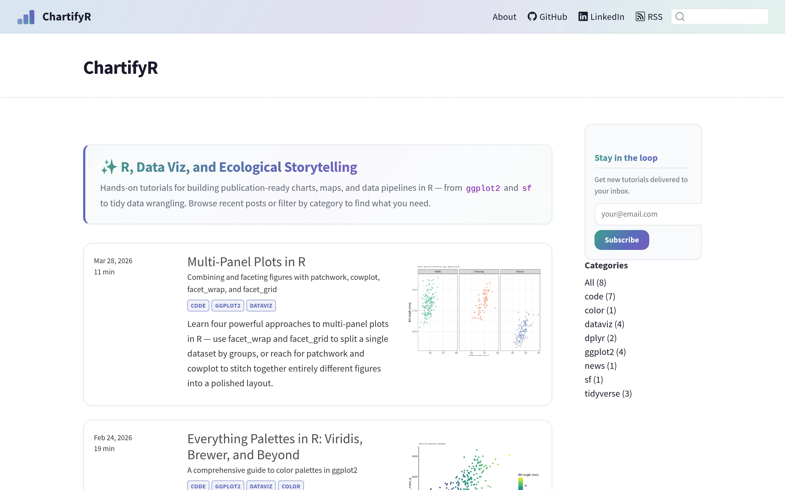

[Read Blog](https://noahweidig.com/chartifyr/){.nw-btn .nw-btn-primary target="_blank"}

ChartifyR is a growing set of R tutorials I write to answer the questions I kept running into while making figures: why my colors weren't colorblind-safe, how to line up several plots without fighting the layout, what actually causes those duplicate rows after a join.

Every post works through a real problem with code you can run, usually on the Palmer Penguins data so anyone can follow along. So far the posts cover ggplot2 from the ground up, color palettes (viridis, RColorBrewer, MetBrewer, wesanderson), faceting and multi-panel layouts with patchwork and cowplot, data wrangling in dplyr, and drawing maps with sf.

It's built in Quarto, and I add to it whenever I learn something worth writing down.
