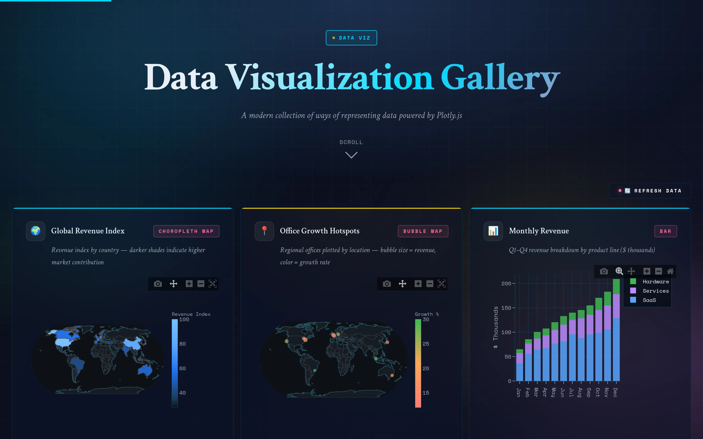

[View Gallery](https://noahweidig.com/dataviz/){.nw-btn .nw-btn-primary target="_blank"}

DataViz is a gallery of interactive charts I built in Plotly while figuring out how far the library could go. Every chart on the page is live: hover for values, zoom, pan, and click the legend to toggle series on and off.

I mostly use it as a reference for myself. When I need a particular chart type again, I can open a working version and lift the pattern instead of starting over. It runs from the usual scatter, line, and bar charts through to the ones I reach for less often, like distributions, heatmaps, and animated bubbles.
