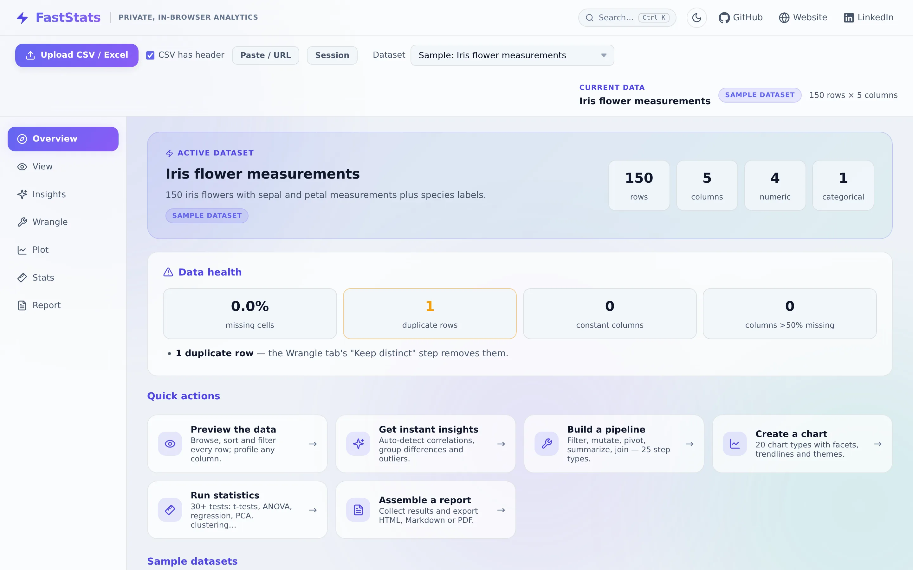

[Open Tool](https://noahweidig.com/faststats/){.nw-btn .nw-btn-primary target="_blank"}

FastStats is a data explorer that runs entirely in your browser. Drop in a CSV or Excel file — or paste a table, or point it at a URL — and it profiles the data, surfaces patterns, and lets you plot and summarize it without anything leaving your computer.

I built it because I kept wanting a quick look at a dataset without spinning up R or handing a file to some website I didn't trust. It's plain JavaScript with Plotly for the charts, so there's no server and no upload. The work is split into tabs — Overview, Insights, Wrangle, Plot, Stats, and Report — and it ships with the Iris, Gapminder, and Palmer Penguins datasets if you just want to poke around.
