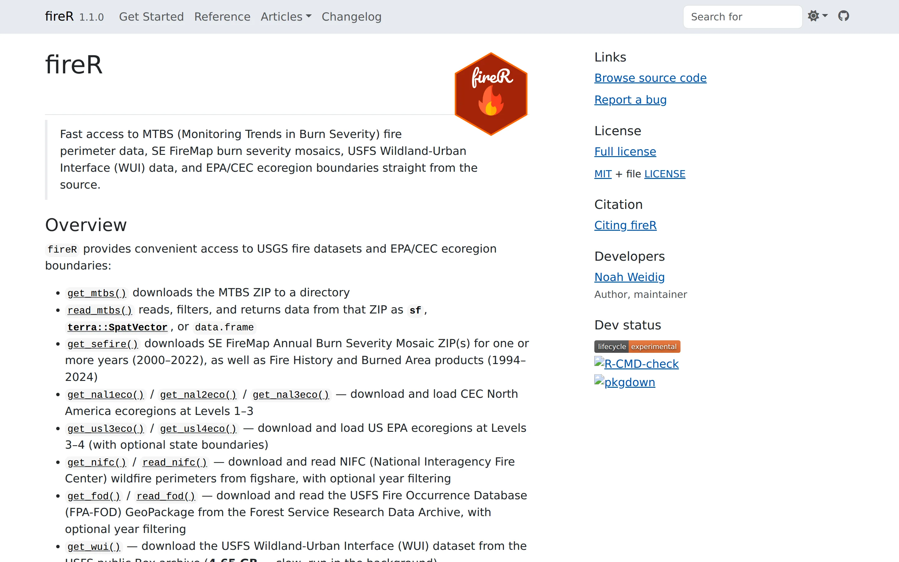

[View Package](https://noahweidig.com/fireR/){.nw-btn .nw-btn-primary target="_blank"}

fireR takes the pain out of getting U.S. wildfire data. The federal fire datasets are scattered across agencies, arrive in different formats, and some are large enough to be a chore to download by hand, so I wrapped the whole process in one consistent set of functions.

Each source has a matching pair. A `get_*()` function downloads and caches the data; a `read_*()` function loads it back with year filtering and your choice of output — an sf object, a terra SpatVector, or a plain data frame. Between them the package covers MTBS burn severity and perimeters, SE FireMap, NIFC perimeters, the FPA-FOD occurrence database, the USFS wildland-urban interface layer, and EPA and CEC ecoregion boundaries.

I wrote it during my thesis so that pulling twenty years of MTBS fires took a single line instead of an afternoon of clicking and converting.
