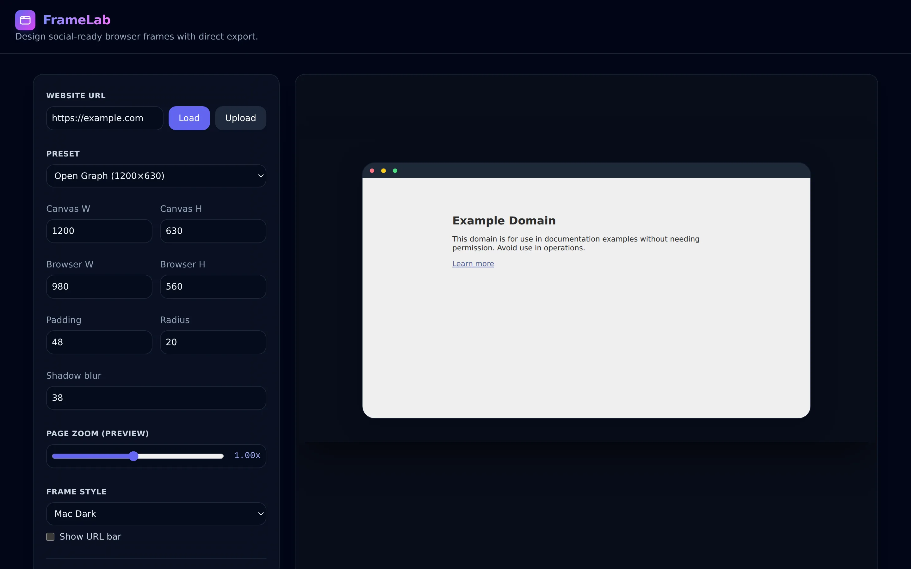

[Launch Tool](https://noahweidig.com/framelab){.nw-btn .nw-btn-primary target="_blank"}

FrameLab wraps a screenshot in a clean browser window, the kind of framed mockup you see in app-store listings and portfolio shots. You give it a URL or an image, pick a light or dark frame, and it renders the result ready to save.

I made it because I was tired of rebuilding the same browser chrome in an image editor every time I wanted a tidy preview of a site. It runs in the browser and exports at high resolution, so the framed image stays sharp when it lands in a slide or a social post.
