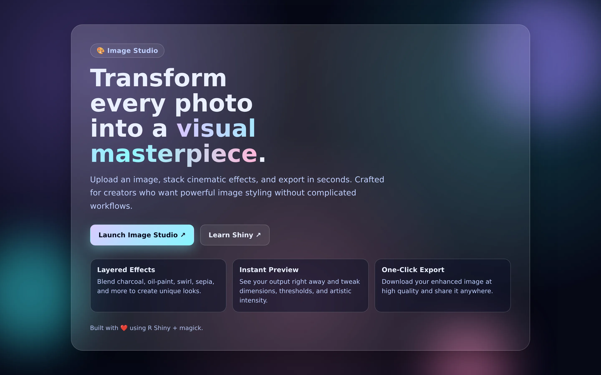

[Launch Tool](https://noahweidig.com/imagestudio){.nw-btn .nw-btn-primary target="_blank"}

Image Studio is a small Shiny app for the image edits I make most often but never want to open Photoshop for: recoloring, resizing, cropping, and basic transforms. Everything happens through sliders and buttons, and you download the result when it looks right.

It started as a way to recolor icons and figures to match a project's palette, and grew from there into a general quick-edit tool.
