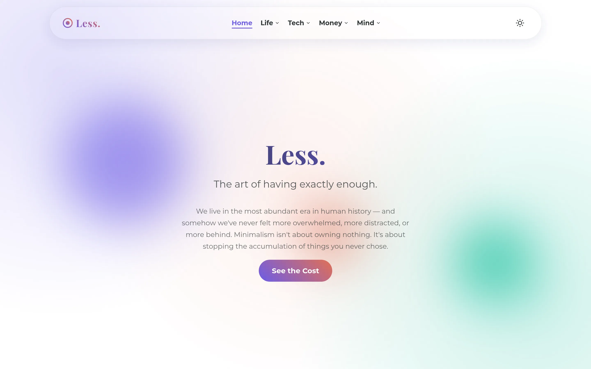

[View Site](https://noahweidig.com/less){.nw-btn .nw-btn-primary target="_blank"}

Less. is a personal essay rather than a tool, a place where I wrote down what paring things back has done for how I live and work. It's about intentional living: keeping fewer, better things and making more room for what actually matters.

I built it as a quiet, deliberately plain page, which felt like the only honest way to write about minimalism.
