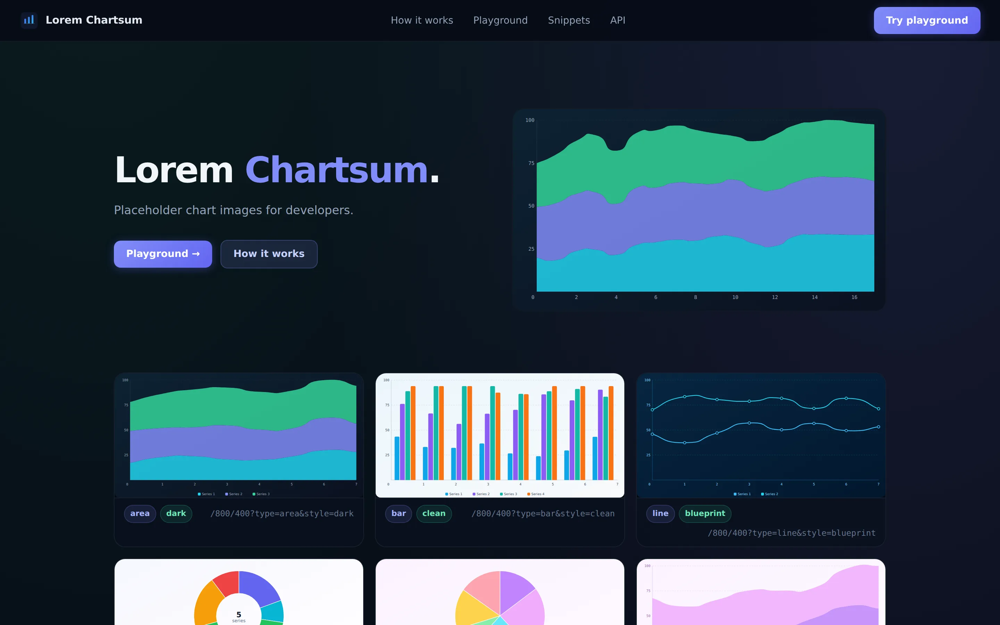

[See API](https://noahweidig.com/lorem-chartsum){.nw-btn .nw-btn-primary target="_blank"}

Lorem Chartsum is a placeholder-chart API — think Lorem Picsum, but for charts. When you're building a dashboard and don't have real data yet, you drop in an image URL and get back a good-looking chart to fill the space.

You set the size in the path and everything else with query parameters: the chart type (eleven of them, from bars and lines to treemaps and heatmaps), the visual style, the number of series, and a seed so the same URL always returns the same chart. It responds with an SVG and long cache headers, which keeps it fast and friendly to a CDN. It runs on a Cloudflare Worker.

A request looks like `/800/400?type=area&style=dark&seed=docs`.
