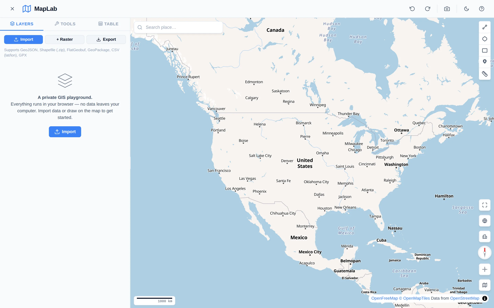

[Launch Tool](https://noahweidig.com/maplab){.nw-btn .nw-btn-primary target="_blank"}

MapLab is GIS in a browser tab, meant for people who need to look at spatial data without opening ArcGIS or QGIS. You import a file, see it on the map, draw or measure, and export the result. There's no install and no account, and nothing gets uploaded — the whole thing runs on your own machine.

It reads the formats people actually hand you: GeoJSON, zipped shapefiles, FlatGeobuf, GeoPackage, CSV with latitude and longitude columns, and GPX. Once the data is loaded you get a layers panel, drawing and measurement tools, and an attribute table, all sitting on OpenFreeMap tiles.

I built it for collaborators who kept emailing me shapefiles and asking whether I could just show them where something was.
