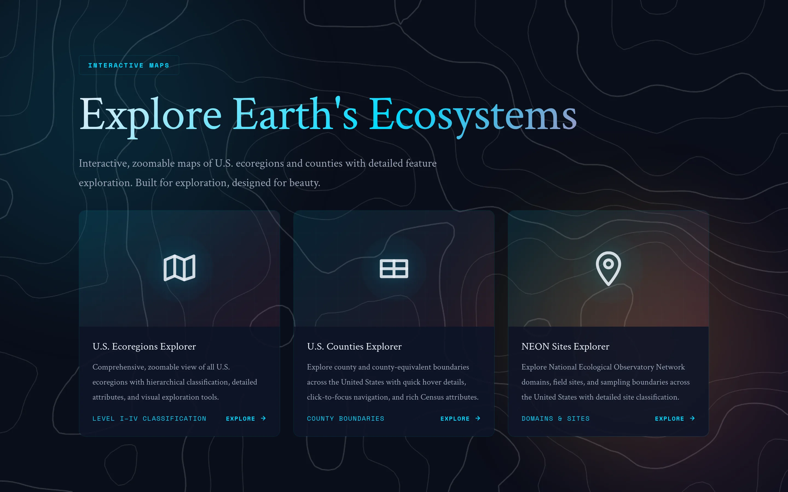

[See Gallery](https://noahweidig.com/maps){.nw-btn .nw-btn-primary target="_blank"}

Map Explorer is where I collect the interactive maps I've made — some pulled from my research, some built just because a dataset was too interesting to leave in a table. Each one is self-contained: pan and zoom to explore the pattern it's showing.

Keeping them in one place serves two purposes. It's a portfolio of cartographic styles I've tried, and it gives me a live example to point to when I'm explaining how I'd approach a mapping problem.
