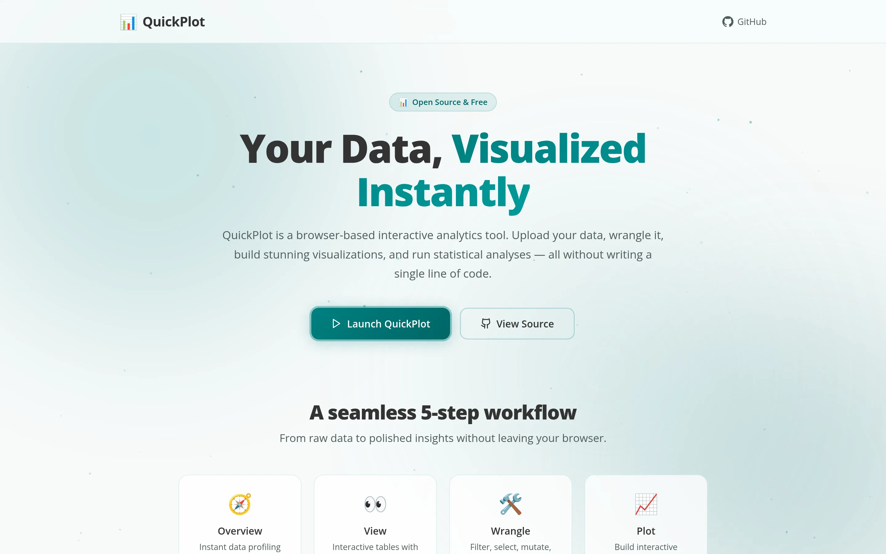

[Launch Tool](https://noahweidig.github.io/quickplot/){.nw-btn .nw-btn-primary target="_blank"}

QuickPlot is a Shiny app for making a solid figure without writing any code. You upload a dataset, choose what goes on each axis, adjust the colors and labels, and download a publication-ready plot.

I built it for collaborators and students who had data and a clear picture of the chart they wanted but didn't want to learn ggplot2 to get there. It's the short path from a spreadsheet to a figure you can drop straight into a slide or a paper.
