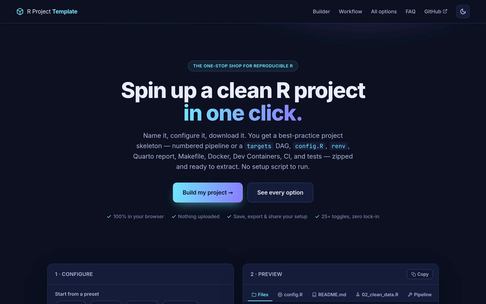

[Launch Tool](https://noahweidig.com/r-proj-template/){.nw-btn .nw-btn-primary target="_blank"}

This is a small site that scaffolds a reproducible R project for you. You fill in your name and preferences, watch the folder structure update in a live preview, and download a ready-to-use project as a ZIP. There's no setup script to run afterward.

It bakes in the conventions I'd otherwise copy from my last project every time: a numbered raw → clean → model → visualize → report pipeline, renv for pinned package versions, and optional extras like targets, testthat, Docker, GitHub Actions, and a Quarto report. A spatial preset wires up sf, terra, and leaflet with a coordinate system you pick. Everything is generated in the browser with JSZip, and your settings save so you can reuse them next time.

I made it to stop reinventing the same skeleton at the start of every analysis.
