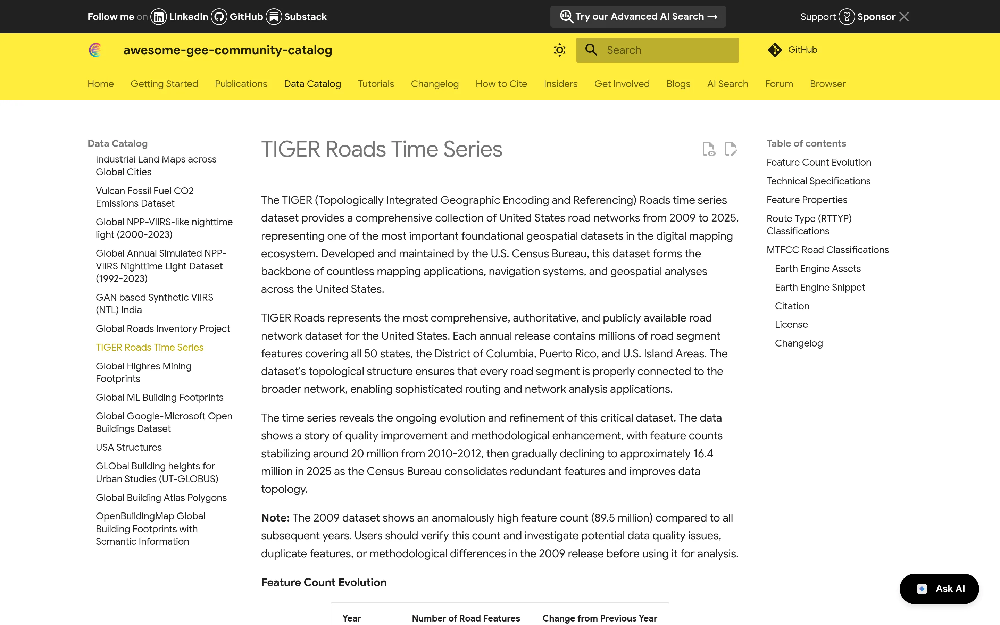

[View Catalog](https://gee-community-catalog.org/projects/tiger_roads/){.nw-btn .nw-btn-primary target="_blank"}

TIGER Roads makes the U.S. Census Bureau's national road network available directly inside Google Earth Engine. The full TIGER/Line roads file is enormous and awkward to work with, so I processed it into an Earth Engine asset that you can pull into an analysis without downloading and converting anything first.

It's published in the Awesome GEE Community Catalog, which is where I go for datasets that never made it into the official archive, so contributing one back felt right. It's handy for any analysis where roads are a variable — accessibility, mapping the wildland-urban interface, or measuring how much infrastructure sits in a hazard zone.
