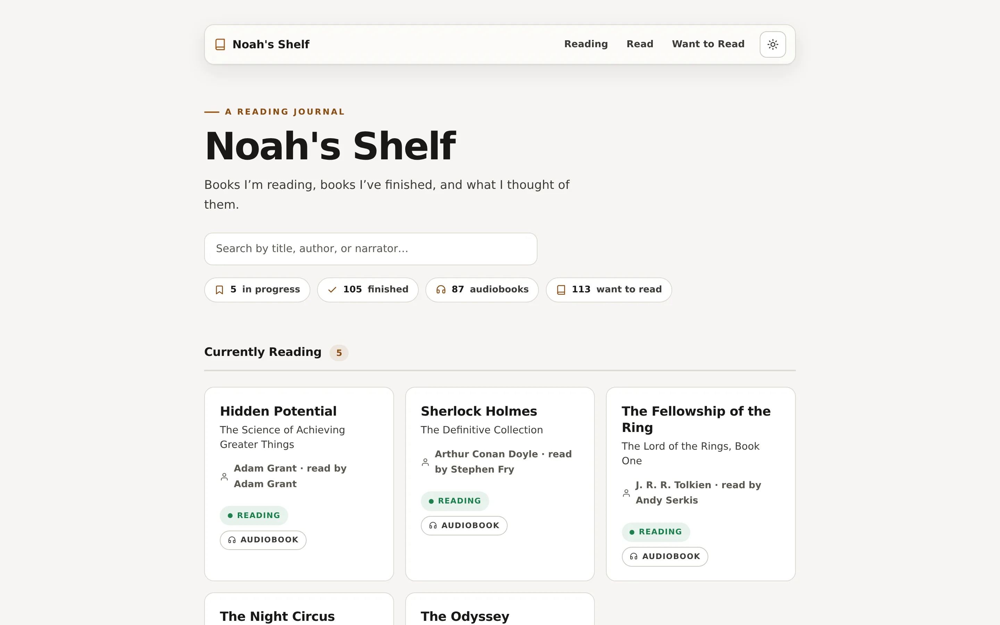

[See Journal](https://noahweidig.com/shelf/){.nw-btn .nw-btn-primary target="_blank"}

Shelf is my reading journal — the books I've finished, the ones I'm partway through, and the pile I mean to get to. For each one I keep a rating, a few favorite quotes, and whatever stuck with me.

I made it because my notes were scattered across apps and I wanted one honest record I'd actually go back to. It also doubles as a small data project: the reading history is structured, so I can chart what I read and how much over time.
