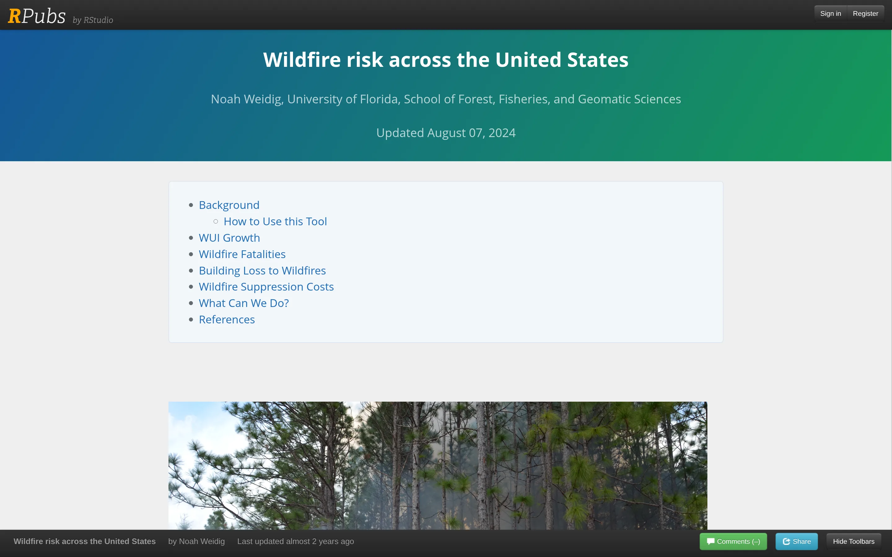

[Launch Tool](https://rpubs.com/noahweidig/us-wildfire-risk){.nw-btn .nw-btn-primary target="_blank"}

This is an interactive report on wildfire risk in the United States, and one of the first pieces of research writing I published. It walks through why risk keeps climbing — the wildland-urban interface is growing, and with it the fatalities, the building losses, and the cost of fighting fires — and then turns to what can actually be done about it.

The charts are interactive, the writing is aimed at a general reader rather than a specialist, and every claim is sourced. I wrote it to practice turning fire-and-land-use data into something someone outside my field could follow and care about.
