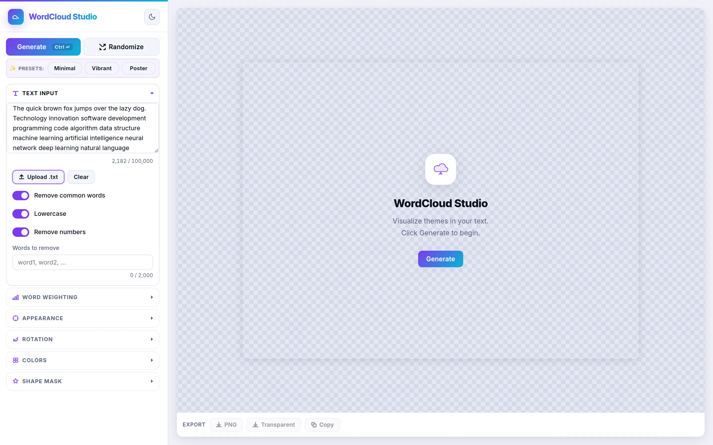

[Launch Tool](https://www.noahweidig.com/wordcloud/){.nw-btn .nw-btn-primary target="_blank"}

WordCloud Studio turns a block of text into a word cloud. Paste something in or upload a file, and it sizes each word by how often it shows up, with colors, fonts, and shapes you can adjust until it looks the way you want.

It's free and needs no account. I built it mostly because the existing generators buried a ten-second task under ads and sign-up walls.
