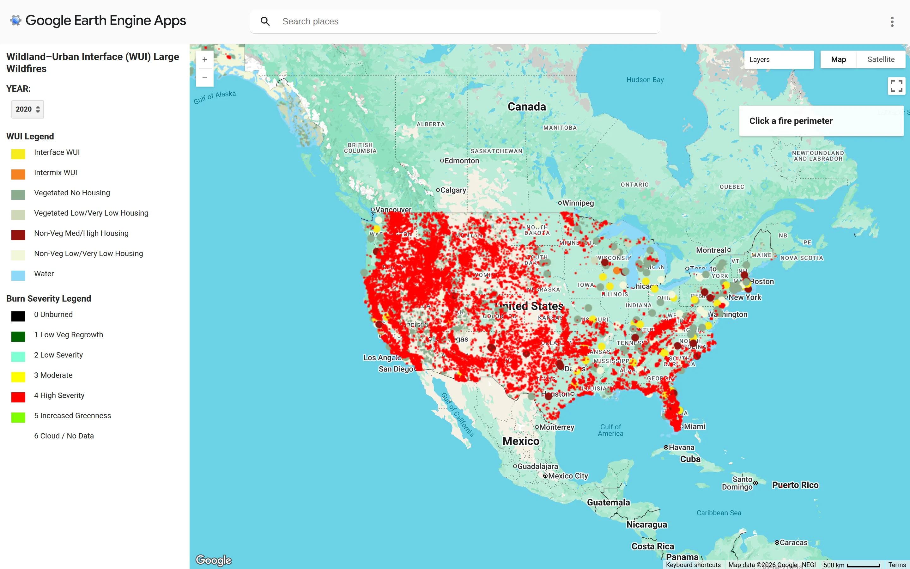

[Launch Tool](https://ee-weidignc.projects.earthengine.app/view/wui-wildfire){.nw-btn .nw-btn-primary target="_blank"}

The WUI Wildfire Explorer is a Google Earth Engine app that maps large wildfires against the wildland-urban interface — the places where houses meet wildland vegetation and fire risk concentrates. It grew directly out of my master's thesis on large-fire patterns in the eastern United States.

You can step through years, see fire perimeters and their burn severity, and read the WUI classification underneath: interface versus intermix, and how much housing sits in vegetated land. Click a perimeter and its details come up. The point is to make an abstract risk concrete — you can watch development push into fire-prone country and see exactly where the two meet.
